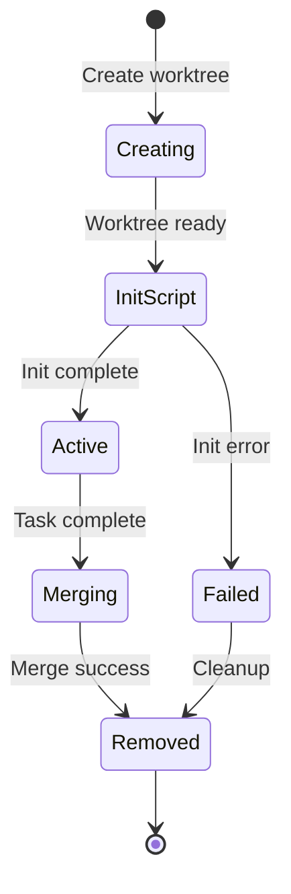
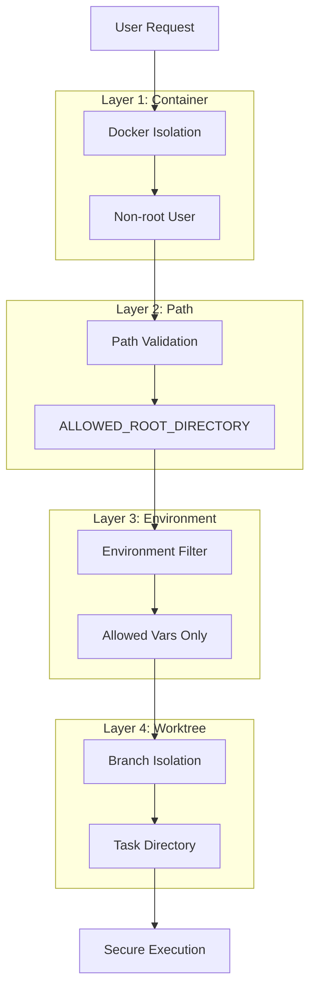

# Isolation Layers

The sandbox implements defense-in-depth security through four independent isolation layers. Each layer provides distinct protections, and all layers must be compromised for a complete security breach.

## Layer 1: Docker Container Isolation

### Purpose

Provides operating system-level isolation between the sandbox and the host system.

### Implementation

```dockerfile
# Non-root user creation with configurable UID/GID
ARG UID=1001
ARG GID=1001
RUN groupadd -o -g ${GID} automaker && \
    useradd -o -u ${UID} -g automaker -m -d /home/automaker -s /bin/bash automaker
```

### Security Properties

| Property | Description |
|----------|-------------|
| **Non-root execution** | Server runs as `automaker` user, not root |
| **No privileged mode** | Container runs without elevated privileges |
| **No host network** | Container uses isolated network namespace |
| **No host PID** | Container uses isolated PID namespace |
| **Resource limits** | CPU/memory limits prevent resource exhaustion |

### Configuration

```yaml
# docker-compose.yml
services:
  server:
    build:
      args:
        UID: ${UID:-1001}
        GID: ${GID:-1001}
    # Security: No privileged mode
    # Security: No host network access
```

### Entrypoint Security

The `docker-entrypoint.sh` script handles permission setup:

```bash
#!/bin/sh
set -e

# Create config directories with restricted permissions
mkdir -p /home/automaker/.claude
chmod 700 /home/automaker/.claude
chown -R automaker:automaker /home/automaker/.claude

# Switch to non-root user before running application
exec gosu automaker "$@"
```

### Protections

- **Host filesystem**: No access to host files outside named volumes
- **Host processes**: Cannot see or interact with host processes
- **Host network**: Cannot access host-only network services
- **Privilege escalation**: Cannot gain root on host

---

## Layer 2: Path Boundary Enforcement

### Purpose

Restricts all file system operations to designated directories, preventing path traversal attacks.

### Implementation

```typescript
// libs/platform/src/security.ts

let allowedRootDirectory: string | null = null;
let dataDirectory: string | null = null;

export function initAllowedPaths(): void {
  allowedRootDirectory = process.env.ALLOWED_ROOT_DIRECTORY
    ? path.resolve(process.env.ALLOWED_ROOT_DIRECTORY)
    : null;
  dataDirectory = process.env.DATA_DIR
    ? path.resolve(process.env.DATA_DIR)
    : null;
}

export function isPathAllowed(filePath: string): boolean {
  const resolvedPath = path.resolve(filePath);

  // Always allow DATA_DIR (settings, credentials)
  if (dataDirectory && isPathWithinDirectory(resolvedPath, dataDirectory)) {
    return true;
  }

  // If no restriction configured, allow all
  if (!allowedRootDirectory) {
    return true;
  }

  // Check against ALLOWED_ROOT_DIRECTORY
  return isPathWithinDirectory(resolvedPath, allowedRootDirectory);
}

export function isPathWithinDirectory(
  resolvedPath: string,
  directoryPath: string
): boolean {
  const relativePath = path.relative(directoryPath, resolvedPath);
  return !relativePath.startsWith('..') && !path.isAbsolute(relativePath);
}
```

### Path Traversal Protection

The `isPathWithinDirectory` function prevents traversal attacks:

```typescript
// Attack attempts that are blocked:
isPathWithinDirectory('/projects/../etc/passwd', '/projects')  // false
isPathWithinDirectory('/projects/../../root', '/projects')     // false
isPathWithinDirectory('/etc/passwd', '/projects')              // false

// Legitimate paths that are allowed:
isPathWithinDirectory('/projects/src/app.ts', '/projects')     // true
isPathWithinDirectory('/projects/nested/deep/file', '/projects') // true
```

### Error Handling

```typescript
export class PathNotAllowedError extends Error {
  constructor(filePath: string) {
    super(`Path not allowed: ${filePath}. Must be within ALLOWED_ROOT_DIRECTORY or DATA_DIR.`);
    this.name = 'PathNotAllowedError';
  }
}

export function validatePath(filePath: string): string {
  const resolvedPath = path.resolve(filePath);
  if (!isPathAllowed(resolvedPath)) {
    throw new PathNotAllowedError(filePath);
  }
  return resolvedPath;
}
```

### Protections

- **Directory escape**: Cannot access files outside allowed directories
- **Symlink attacks**: Path resolution prevents symlink-based escapes
- **Null byte injection**: Path normalization handles null bytes

---

## Layer 3: Environment Variable Isolation

### Purpose

Prevents sensitive environment variables from leaking to AI agents and subprocesses.

### Implementation

```typescript
// apps/server/src/providers/claude-provider.ts

const ALLOWED_ENV_VARS = [
  'ANTHROPIC_API_KEY',
  'ANTHROPIC_BASE_URL',
  'ANTHROPIC_AUTH_TOKEN',
  'PATH',
  'HOME',
  'SHELL',
  'TERM',
  'USER',
  'LANG',
  'LC_ALL',
];

function buildEnv(): Record<string, string | undefined> {
  const env: Record<string, string | undefined> = {};
  for (const key of ALLOWED_ENV_VARS) {
    if (process.env[key]) {
      env[key] = process.env[key];
    }
  }
  return env;
}
```

### Terminal Environment Sanitization

```typescript
// apps/server/src/services/terminal-service.ts

// Exclude Automaker-specific variables from terminal sessions
const automakerEnvVars = ['PORT', 'DATA_DIR', 'AUTOMAKER_API_KEY', 'NODE_PATH'];
const cleanEnv: Record<string, string> = {};

for (const [key, value] of Object.entries(process.env)) {
  if (value !== undefined && !automakerEnvVars.includes(key)) {
    cleanEnv[key] = value;
  }
}

const env: Record<string, string> = {
  ...cleanEnv,
  TERM: 'xterm-256color',
  COLORTERM: 'truecolor',
  TERM_PROGRAM: 'automaker-terminal',
  LANG: process.env.LANG || 'en_US.UTF-8',
};
```

### SDK Environment Passthrough

```typescript
const sdkOptions: Options = {
  model,
  // Only allowed environment variables reach the SDK
  env: buildEnv(),
  permissionMode: 'bypassPermissions',
  allowDangerouslySkipPermissions: true,
};
```

### Protections

- **API key leakage**: Only necessary API keys are passed
- **Secret exposure**: Internal secrets don't reach subprocesses
- **Cross-contamination**: Service ports/paths not exposed to agents

---

## Layer 4: Git Worktree Isolation

### Purpose

Provides task-level isolation by executing each task in a dedicated git worktree.

### Implementation

```typescript
// apps/server/src/lib/worktree-metadata.ts

export interface WorktreeMetadata {
  branch: string;
  createdAt: string;
  pr?: WorktreePRInfo;
  initScriptRan?: boolean;
  initScriptStatus?: 'running' | 'success' | 'failed';
  initScriptError?: string;
}

function sanitizeBranchName(branch: string): string {
  return branch
    .replace(/[/\\:*?"<>|]/g, '-')  // Replace invalid chars
    .replace(/\s+/g, '_')           // Replace spaces
    .replace(/\.+$/g, '')           // Remove trailing dots
    .replace(/-+/g, '-')            // Collapse dashes
    .replace(/^-|-$/g, '')          // Remove leading/trailing dashes
    .substring(0, 200);             // Truncate to safe length
}
```

### Worktree Lifecycle



### Directory Structure

```
/projects/my-project/
├── .git/                      # Main repository
├── .automaker/
│   └── worktrees/
│       └── feature-auth/      # Sanitized branch name
│           └── worktree.json  # Metadata
└── src/                       # Main branch files

/projects/my-project-worktrees/
└── feature-auth/              # Isolated worktree
    ├── .git                   # Worktree git link
    └── src/                   # Branch-specific files
```

### Protections

- **Cross-task access**: Each task sees only its own branch
- **Parallel execution**: Multiple agents can work simultaneously
- **Rollback capability**: Easy to discard failed work
- **Merge control**: Changes reviewed before reaching main

---

## Layer Interaction



## Security Guarantees

| Layer | Guarantee | Failure Mode |
|-------|-----------|--------------|
| 1 | Host isolation | Container escape required |
| 2 | Directory boundary | Path validation bypass required |
| 3 | Credential protection | Environment injection required |
| 4 | Task isolation | Branch manipulation required |

## Verification Checklist

### Layer 1 Verification

- [ ] Container runs as non-root user
- [ ] No host bind mounts in production
- [ ] No privileged mode enabled
- [ ] Resource limits configured

### Layer 2 Verification

- [ ] `ALLOWED_ROOT_DIRECTORY` is set
- [ ] All file operations use `secureFs`
- [ ] Path traversal tests pass
- [ ] `DATA_DIR` exception works correctly

### Layer 3 Verification

- [ ] Only allowlisted vars reach SDK
- [ ] Terminal sessions don't leak secrets
- [ ] Service ports excluded from env

### Layer 4 Verification

- [ ] Worktrees created for each task
- [ ] Branch names properly sanitized
- [ ] Metadata persisted correctly
- [ ] Cleanup removes worktrees

## Related Documents

- [Overview](./overview.md) - High-level architecture
- [Secure FS](../security/secure-fs.md) - File system adapter
- [Environment Variables](../security/environment-variables.md) - Env filtering
- [Worktree Lifecycle](../worktree/worktree-lifecycle.md) - Git isolation
