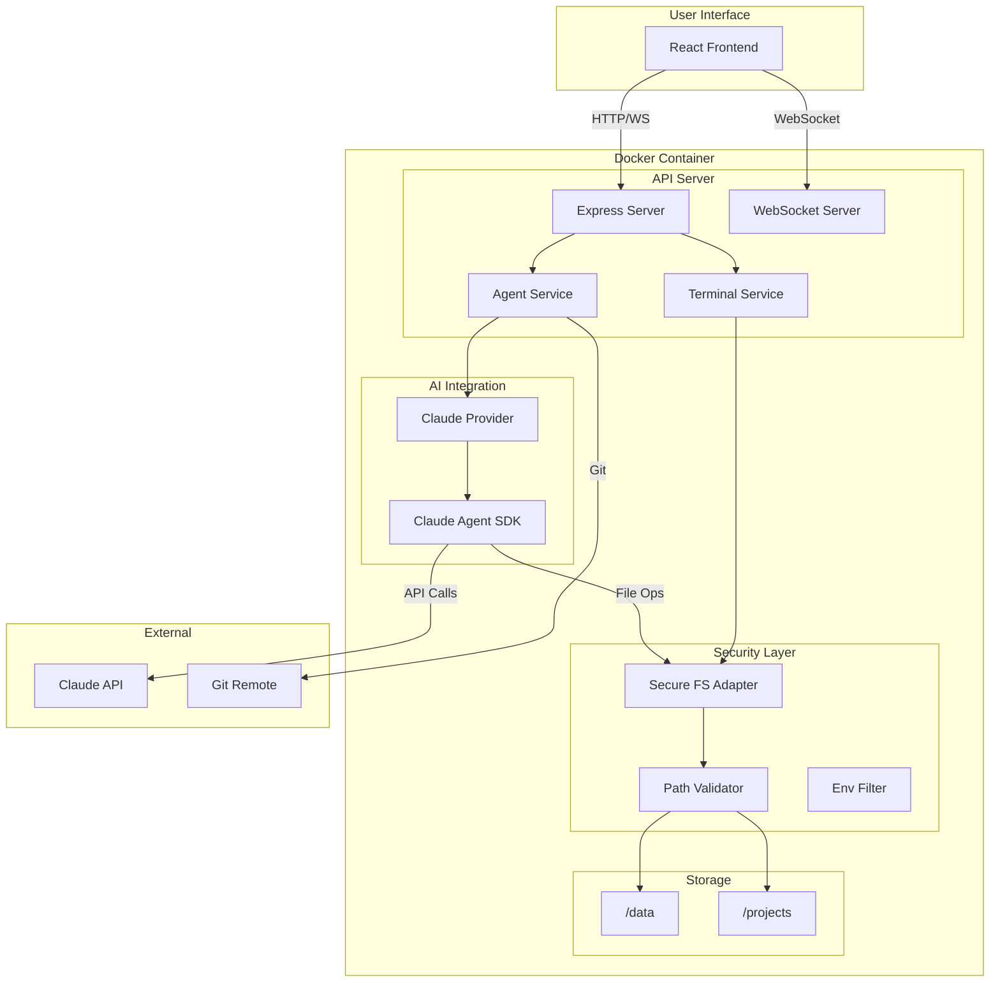
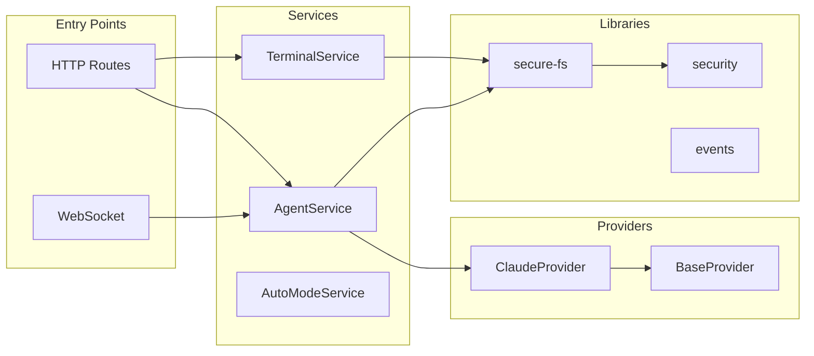
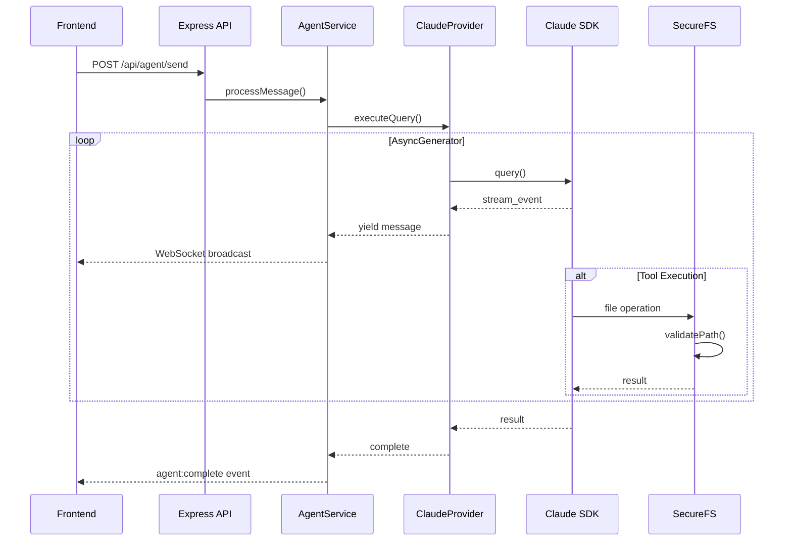
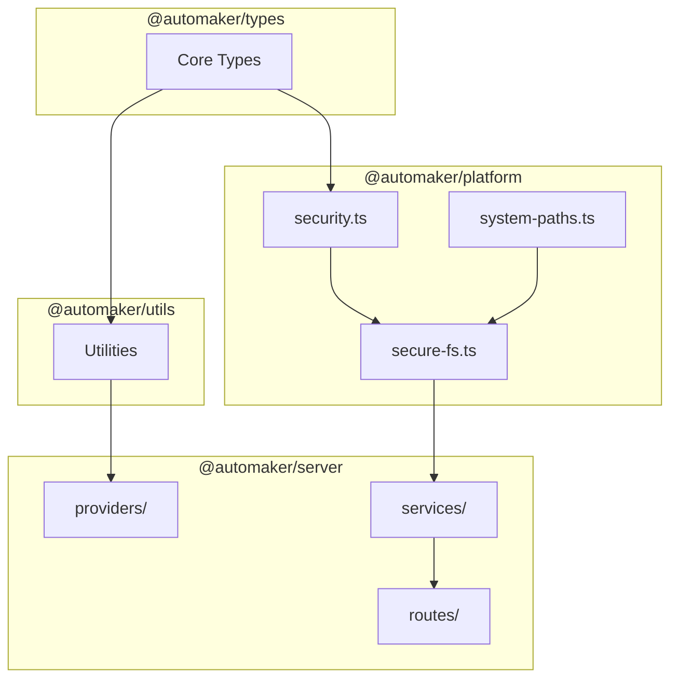
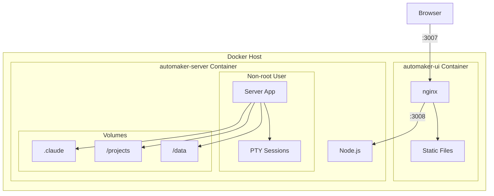
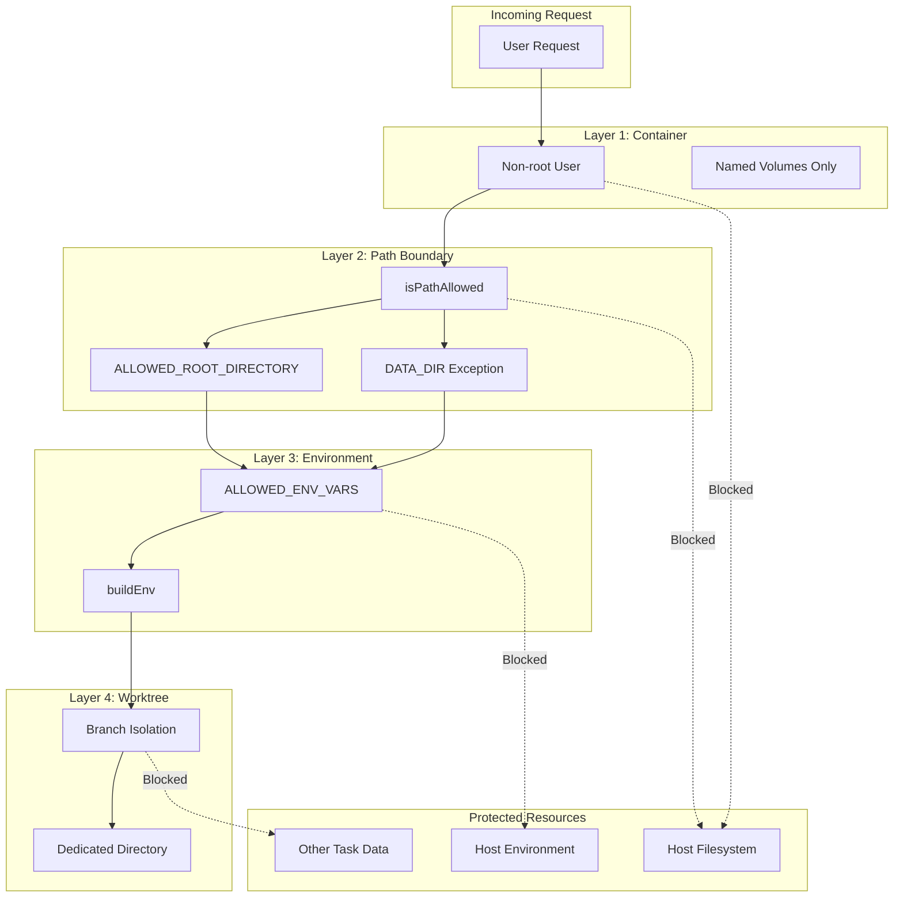
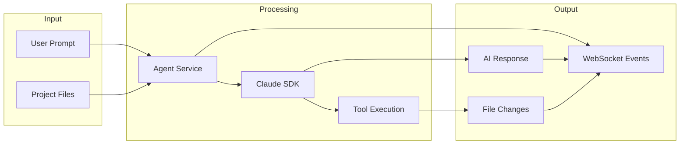

# Architecture Overview

## System Context

The sandbox architecture provides secure, isolated execution of Claude AI agents within Docker containers. It enables autonomous code generation, file manipulation, and shell command execution while protecting the host system.

## Component Architecture

### Server Components

### Request Flow

## Module Dependencies

## Container Architecture

## Security Architecture

## Data Flow

## Key Design Decisions

### 1. Defense in Depth

Multiple independent security layers ensure that a breach in one layer doesn't compromise the entire system:

- **Container isolation** prevents host access
- **Path validation** prevents file system escape
- **Environment filtering** prevents credential leakage
- **Worktree isolation** prevents cross-task interference

### 2. Autonomous Mode

The SDK runs in fully autonomous mode (`bypassPermissions: true`) because:

- All security is handled at the infrastructure level
- The agent needs to execute tools without interactive approval
- User consent is given at task creation, not tool execution

### 3. Named Volumes Only

No host bind mounts are allowed in production because:

- Named volumes are managed by Docker, not accessible from host
- Prevents accidental exposure of host files
- Enables consistent behavior across environments

### 4. Non-root Execution

The container runs as the `automaker` user because:

- Limits damage from potential container escape
- Allows UID/GID matching for mounted volumes
- Follows security best practices

## Related Documents

- [Isolation Layers](./isolation-layers.md) - Detailed breakdown of each security layer
- [Container Dockerfile](../container/dockerfile.md) - Multi-stage build configuration
- [SDK Provider](../sdk-integration/provider.md) - Claude SDK integration
