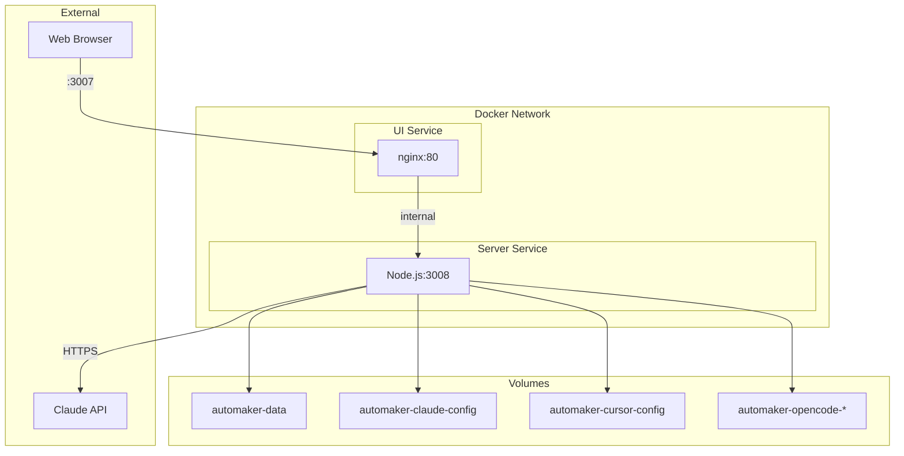

# Docker Compose Specification

## Overview

Docker Compose orchestrates the multi-container sandbox environment, managing service dependencies, networking, volumes, and environment configuration.

## Service Architecture



## Complete Configuration

```yaml
# docker-compose.yml
services:
  # Frontend UI
  ui:
    build:
      context: .
      dockerfile: Dockerfile
      target: ui
    container_name: automaker-ui
    restart: unless-stopped
    ports:
      - '3007:80'
    depends_on:
      - server

  # Backend API Server
  server:
    build:
      context: .
      dockerfile: Dockerfile
      target: server
      args:
        UID: ${UID:-1001}
        GID: ${GID:-1001}
    container_name: automaker-server
    restart: unless-stopped
    ports:
      - '3008:3008'
    environment:
      - ANTHROPIC_API_KEY=${ANTHROPIC_API_KEY}
      - CLAUDE_OAUTH_CREDENTIALS=${CLAUDE_OAUTH_CREDENTIALS:-}
      - CURSOR_AUTH_TOKEN=${CURSOR_AUTH_TOKEN:-}
      - AUTOMAKER_API_KEY=${AUTOMAKER_API_KEY:-}
      - ALLOWED_ROOT_DIRECTORY=${ALLOWED_ROOT_DIRECTORY:-/projects}
      - DATA_DIR=/data
      - CORS_ORIGIN=${CORS_ORIGIN:-http://localhost:3007}
      - IS_CONTAINERIZED=true
    volumes:
      - automaker-data:/data
      - automaker-claude-config:/home/automaker/.claude
      - automaker-cursor-config:/home/automaker/.cursor
      - automaker-opencode-data:/home/automaker/.local/share/opencode
      - automaker-opencode-config:/home/automaker/.config/opencode
      - automaker-opencode-cache:/home/automaker/.cache/opencode

volumes:
  automaker-data:
    name: automaker-data
  automaker-claude-config:
    name: automaker-claude-config
  automaker-cursor-config:
    name: automaker-cursor-config
  automaker-opencode-data:
    name: automaker-opencode-data
  automaker-opencode-config:
    name: automaker-opencode-config
  automaker-opencode-cache:
    name: automaker-opencode-cache
```

## Service Definitions

### UI Service

| Property | Value | Description |
|----------|-------|-------------|
| `image` | Built from `ui` target | nginx:alpine based |
| `container_name` | `automaker-ui` | Fixed name for easy reference |
| `restart` | `unless-stopped` | Auto-restart unless manually stopped |
| `ports` | `3007:80` | External port 3007 → container port 80 |
| `depends_on` | `server` | Starts after server is ready |

### Server Service

| Property | Value | Description |
|----------|-------|-------------|
| `image` | Built from `server` target | node:22-slim based |
| `container_name` | `automaker-server` | Fixed name for easy reference |
| `restart` | `unless-stopped` | Auto-restart unless manually stopped |
| `ports` | `3008:3008` | External port 3008 → container port 3008 |

## Environment Variables

### Required

| Variable | Purpose |
|----------|---------|
| `ANTHROPIC_API_KEY` | Claude API authentication |

### Optional - Authentication

| Variable | Purpose | Default |
|----------|---------|---------|
| `CLAUDE_OAUTH_CREDENTIALS` | Claude CLI OAuth tokens | Empty |
| `CURSOR_AUTH_TOKEN` | Cursor CLI access token | Empty |
| `AUTOMAKER_API_KEY` | Automaker API authentication | Auto-generated |

### Optional - Configuration

| Variable | Purpose | Default |
|----------|---------|---------|
| `ALLOWED_ROOT_DIRECTORY` | File access boundary | `/projects` |
| `DATA_DIR` | Session/settings storage | `/data` |
| `CORS_ORIGIN` | Allowed CORS origin | `http://localhost:3007` |
| `IS_CONTAINERIZED` | Sandbox mode indicator | `true` |

### Build Arguments

| Variable | Purpose | Default |
|----------|---------|---------|
| `UID` | Container user ID | `1001` |
| `GID` | Container group ID | `1001` |

## Volume Configuration

### Named Volumes

```yaml
volumes:
  automaker-data:
    name: automaker-data
    # Session data, settings, credentials
    # Mount: /data

  automaker-claude-config:
    name: automaker-claude-config
    # Claude CLI OAuth tokens
    # Mount: /home/automaker/.claude

  automaker-cursor-config:
    name: automaker-cursor-config
    # Cursor CLI authentication
    # Mount: /home/automaker/.cursor

  automaker-opencode-data:
    name: automaker-opencode-data
    # OpenCode CLI data and auth
    # Mount: /home/automaker/.local/share/opencode

  automaker-opencode-config:
    name: automaker-opencode-config
    # OpenCode user configuration
    # Mount: /home/automaker/.config/opencode

  automaker-opencode-cache:
    name: automaker-opencode-cache
    # OpenCode cache data
    # Mount: /home/automaker/.cache/opencode
```

### Volume Security

**Critical**: No host bind mounts in production configuration.

```yaml
# ❌ NEVER do this in production
volumes:
  - /home/user/projects:/projects  # Host filesystem access!

# ✅ Only named volumes
volumes:
  - automaker-data:/data  # Docker-managed, isolated
```

## Security Properties

### Network Isolation

- No `network_mode: host`
- Services communicate via Docker network
- Only mapped ports are accessible from host

### No Privileged Mode

```yaml
# Not present in config - defaults to false
privileged: false
```

### No Extra Capabilities

```yaml
# Not present - no extra capabilities granted
cap_add: []
```

### Resource Limits (Optional)

```yaml
services:
  server:
    deploy:
      resources:
        limits:
          cpus: '2'
          memory: 4G
        reservations:
          cpus: '0.5'
          memory: 512M
```

## Operational Commands

### Start Services

```bash
# Start in foreground
docker-compose up

# Start in background
docker-compose up -d

# With build
docker-compose up -d --build
```

### Build with Host User

```bash
# Match container user to host user
UID=$(id -u) GID=$(id -g) docker-compose build

# Or set in .env file
echo "UID=$(id -u)" >> .env
echo "GID=$(id -g)" >> .env
docker-compose build
```

### View Logs

```bash
# All services
docker-compose logs -f

# Server only
docker-compose logs -f server

# Last 100 lines
docker-compose logs --tail=100 server
```

### Execute Commands

```bash
# Shell access
docker-compose exec server bash

# Run as root
docker-compose exec -u root server bash

# Check Claude auth
docker-compose exec server claude auth status
```

### Stop Services

```bash
# Stop but keep volumes
docker-compose down

# Stop and remove volumes
docker-compose down -v

# Stop, remove volumes, and images
docker-compose down -v --rmi all
```

## Environment File

Create `.env` for persistent configuration:

```bash
# .env
ANTHROPIC_API_KEY=sk-ant-...
UID=1000
GID=1000
CORS_ORIGIN=http://localhost:3007
```

Load automatically:
```bash
docker-compose up -d  # Reads .env automatically
```

## Health Checks

The server includes a health check:

```yaml
# In Dockerfile (not compose, but affects compose)
HEALTHCHECK --interval=30s --timeout=3s --start-period=5s --retries=3 \
    CMD curl -f http://localhost:3008/api/health || exit 1
```

Check health status:
```bash
docker-compose ps
# Shows health status

docker inspect automaker-server | jq '.[0].State.Health'
```

## Development Override

Create `docker-compose.override.yml` for development:

```yaml
# docker-compose.override.yml
services:
  server:
    volumes:
      # Mount local projects (development only!)
      - ./my-project:/projects/my-project
    environment:
      - NODE_ENV=development
      - DEBUG=*
```

**Warning**: Override files should never be committed for production use.

## Related Documents

- [Dockerfile](./dockerfile.md) - Build configuration
- [Entrypoint](./entrypoint.md) - Startup script
- [Volumes](./volumes.md) - Volume details
