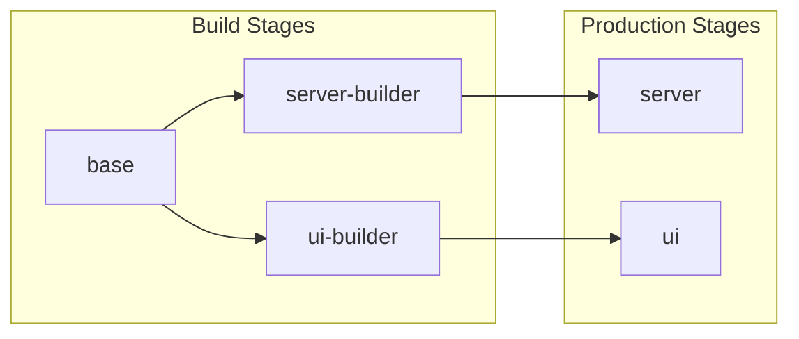

# Dockerfile Specification

## Overview

The sandbox uses a multi-stage Dockerfile to create optimized, secure container images for both the UI (nginx) and server (Node.js) components.

## Multi-Stage Build Architecture



## Stage 1: Base

Common foundation for all builds with Node.js and build dependencies.

```dockerfile
FROM node:22-slim AS base

# Install build dependencies for native modules (node-pty)
RUN apt-get update && apt-get install -y --no-install-recommends \
    python3 make g++ \
    && rm -rf /var/lib/apt/lists/*

WORKDIR /app

# Copy package files for dependency installation
COPY package*.json ./
COPY libs/types/package*.json ./libs/types/
COPY libs/utils/package*.json ./libs/utils/
COPY libs/prompts/package*.json ./libs/prompts/
COPY libs/platform/package*.json ./libs/platform/
COPY libs/model-resolver/package*.json ./libs/model-resolver/
COPY libs/dependency-resolver/package*.json ./libs/dependency-resolver/
COPY libs/git-utils/package*.json ./libs/git-utils/

COPY scripts ./scripts
```

### Dependencies

| Package | Purpose |
|---------|---------|
| `python3` | Required for node-gyp |
| `make` | Build tooling |
| `g++` | C++ compiler for native modules |

## Stage 2: Server Builder

Builds the server application with all dependencies.

```dockerfile
FROM base AS server-builder

COPY apps/server/package*.json ./apps/server/

# Install dependencies and rebuild native modules
RUN npm ci --ignore-scripts && npm rebuild node-pty

# Copy source and build
COPY libs ./libs
COPY apps/server ./apps/server
RUN npm run build:packages && npm run build --workspace=apps/server
```

### Build Outputs

- `apps/server/dist/` - Compiled TypeScript
- `node_modules/` - Runtime dependencies

## Stage 3: Server Production

Production-ready server image with minimal footprint.

```dockerfile
FROM node:22-slim AS server

# Build arguments for user ID matching
ARG UID=1001
ARG GID=1001
ARG GIT_COMMIT_SHA=unknown

LABEL automaker.git.commit.sha="${GIT_COMMIT_SHA}"
```

### Runtime Dependencies

```dockerfile
RUN apt-get update && apt-get install -y --no-install-recommends \
    git curl bash gosu ca-certificates openssh-client \
    # Playwright/Chromium dependencies
    libglib2.0-0 libnss3 libnspr4 libdbus-1-3 libatk1.0-0 libatk-bridge2.0-0 \
    libcups2 libdrm2 libxkbcommon0 libatspi2.0-0 libxcomposite1 libxdamage1 \
    libxfixes3 libxrandr2 libgbm1 libasound2 libpango-1.0-0 libcairo2 \
    libx11-6 libx11-xcb1 libxcb1 libxext6 libxrender1 libxss1 libxtst6 \
    libxshmfence1 libgtk-3-0 libexpat1 libfontconfig1 fonts-liberation \
    xdg-utils libpangocairo-1.0-0 libpangoft2-1.0-0 libu2f-udev libvulkan1
```

| Package | Purpose |
|---------|---------|
| `git` | Git operations |
| `curl` | HTTP client for health checks |
| `bash` | Shell for terminals |
| `gosu` | User switching in entrypoint |
| `ca-certificates` | SSL/TLS certificates |
| `openssh-client` | SSH for git operations |
| `libglib2.0-0`, etc. | Playwright/Chromium browser |

### GitHub CLI Installation

```dockerfile
RUN GH_VERSION="2.63.2" \
    && ARCH=$(uname -m) \
    && case "$ARCH" in \
        x86_64) GH_ARCH="amd64" ;; \
        aarch64|arm64) GH_ARCH="arm64" ;; \
        *) echo "Unsupported architecture: $ARCH" && exit 1 ;; \
    esac \
    && curl -L "https://github.com/cli/cli/releases/download/v${GH_VERSION}/gh_${GH_VERSION}_linux_${GH_ARCH}.tar.gz" -o gh.tar.gz \
    && tar -xzf gh.tar.gz \
    && mv gh_${GH_VERSION}_linux_${GH_ARCH}/bin/gh /usr/local/bin/gh \
    && rm -rf gh.tar.gz gh_${GH_VERSION}_linux_${GH_ARCH}
```

### CLI Tools Installation

```dockerfile
# Claude CLI (npm global)
RUN npm install -g @anthropic-ai/claude-code

# Cursor CLI (installer script, as automaker user)
USER automaker
RUN curl https://cursor.com/install -fsS | bash

# OpenCode CLI (installer script)
RUN curl -fsSL https://opencode.ai/install | bash
USER root
```

### Non-root User Setup

```dockerfile
# Create user with configurable UID/GID
RUN groupadd -o -g ${GID} automaker && \
    useradd -o -u ${UID} -g automaker -m -d /home/automaker -s /bin/bash automaker && \
    mkdir -p /home/automaker/.local/bin && \
    mkdir -p /home/automaker/.cursor && \
    chown -R automaker:automaker /home/automaker && \
    chmod 700 /home/automaker/.cursor
```

### PATH Configuration

```dockerfile
# Add user's local bin to PATH for CLI tools
ENV PATH="/home/automaker/.local/bin:${PATH}"

# Profile.d for login shells
RUN echo 'export PATH="/home/automaker/.local/bin:$PATH"' > /etc/profile.d/cursor-cli.sh

# Bashrc for interactive shells
RUN echo 'export PATH="/home/automaker/.local/bin:$PATH"' >> /home/automaker/.bashrc
```

### Application Setup

```dockerfile
WORKDIR /app

# Copy built artifacts from builder
COPY --from=server-builder /app/package*.json ./
COPY --from=server-builder /app/libs ./libs
COPY --from=server-builder /app/apps/server/dist ./apps/server/dist
COPY --from=server-builder /app/apps/server/package*.json ./apps/server/
COPY --from=server-builder /app/node_modules ./node_modules

# Create data and projects directories
RUN mkdir -p /data /projects && chown automaker:automaker /data /projects

# Configure git for mounted volumes
RUN git config --system --add safe.directory '*' && \
    git config --system credential.helper '!gh auth git-credential'
```

### Entrypoint and Health Check

```dockerfile
COPY docker-entrypoint.sh /usr/local/bin/docker-entrypoint.sh
RUN chmod +x /usr/local/bin/docker-entrypoint.sh

ENV PORT=3008
ENV DATA_DIR=/data
ENV HOME=/home/automaker

EXPOSE 3008

HEALTHCHECK --interval=30s --timeout=3s --start-period=5s --retries=3 \
    CMD curl -f http://localhost:3008/api/health || exit 1

ENTRYPOINT ["/usr/local/bin/docker-entrypoint.sh"]
CMD ["node", "apps/server/dist/index.js"]
```

## Stage 4: UI Production

Nginx-based frontend serving static files.

```dockerfile
FROM base AS ui-builder

COPY apps/ui/package*.json ./apps/ui/
RUN npm ci --ignore-scripts

COPY libs ./libs
COPY apps/ui ./apps/ui

ARG VITE_SERVER_URL=http://localhost:3008
ENV VITE_SKIP_ELECTRON=true
ENV VITE_SERVER_URL=${VITE_SERVER_URL}

RUN npm run build:packages && npm run build --workspace=apps/ui

FROM nginx:alpine AS ui

ARG GIT_COMMIT_SHA=unknown
LABEL automaker.git.commit.sha="${GIT_COMMIT_SHA}"

COPY --from=ui-builder /app/apps/ui/dist /usr/share/nginx/html
COPY apps/ui/nginx.conf /etc/nginx/conf.d/default.conf

EXPOSE 80
CMD ["nginx", "-g", "daemon off;"]
```

## Build Arguments

| Argument | Default | Description |
|----------|---------|-------------|
| `UID` | `1001` | User ID for volume permissions |
| `GID` | `1001` | Group ID for volume permissions |
| `GIT_COMMIT_SHA` | `unknown` | Commit SHA for image tracking |
| `VITE_SERVER_URL` | `http://localhost:3008` | API server URL for UI |

## Build Commands

```bash
# Build server image
docker build --target server -t automaker-server .

# Build UI image
docker build --target ui -t automaker-ui .

# Build with host user matching
docker build --target server \
  --build-arg UID=$(id -u) \
  --build-arg GID=$(id -g) \
  -t automaker-server .

# Build with commit tracking
docker build --target server \
  --build-arg GIT_COMMIT_SHA=$(git rev-parse HEAD) \
  -t automaker-server .
```

## Security Considerations

### Build Security

- Dependencies installed from official repositories
- Build tools not included in production image
- Multi-stage build minimizes attack surface

### Runtime Security

- Non-root user by default
- Configurable UID/GID for volume permissions
- No setuid binaries except gosu
- Minimal installed packages

### Image Verification

```bash
# Verify image labels
docker inspect automaker-server | jq '.[0].Config.Labels'

# Check running user
docker run --rm automaker-server whoami  # Should output: automaker
```

## Related Documents

- [Entrypoint](./entrypoint.md) - Container startup script
- [Compose](./compose.md) - Docker Compose configuration
- [Volumes](./volumes.md) - Volume management
