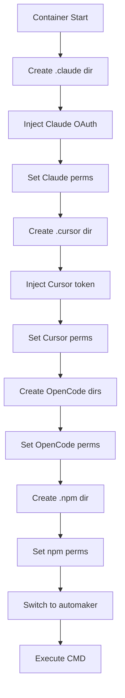

# Docker Entrypoint Specification

## Overview

The `docker-entrypoint.sh` script handles container initialization, permission setup, and credential injection before starting the main application.

## Script Flow



## Full Script

```bash
#!/bin/sh
set -e

# =============================================================================
# Claude CLI Configuration
# =============================================================================

# Ensure Claude CLI config directory exists with correct permissions
if [ ! -d "/home/automaker/.claude" ]; then
    mkdir -p /home/automaker/.claude
fi

# If CLAUDE_OAUTH_CREDENTIALS is set, write it to the credentials file
# This allows passing OAuth tokens from host (especially macOS where they're in Keychain)
if [ -n "$CLAUDE_OAUTH_CREDENTIALS" ]; then
    echo "$CLAUDE_OAUTH_CREDENTIALS" > /home/automaker/.claude/.credentials.json
    chmod 600 /home/automaker/.claude/.credentials.json
fi

# Fix permissions on Claude CLI config directory
chown -R automaker:automaker /home/automaker/.claude
chmod 700 /home/automaker/.claude

# =============================================================================
# Cursor CLI Configuration
# =============================================================================

# Ensure Cursor CLI config directory exists with correct permissions
if [ ! -d "/home/automaker/.cursor" ]; then
    mkdir -p /home/automaker/.cursor
fi
chown -R automaker:automaker /home/automaker/.cursor
chmod -R 700 /home/automaker/.cursor

# If CURSOR_AUTH_TOKEN is set, write it to the cursor auth file
if [ -n "$CURSOR_AUTH_TOKEN" ]; then
    CURSOR_CONFIG_DIR="/home/automaker/.config/cursor"
    mkdir -p "$CURSOR_CONFIG_DIR"
    cat > "$CURSOR_CONFIG_DIR/auth.json" << EOF
{
  "accessToken": "$CURSOR_AUTH_TOKEN"
}
EOF
    chmod 600 "$CURSOR_CONFIG_DIR/auth.json"
    chown -R automaker:automaker /home/automaker/.config
fi

# =============================================================================
# OpenCode CLI Configuration
# =============================================================================

# Ensure OpenCode data directory exists
if [ ! -d "/home/automaker/.local/share/opencode" ]; then
    mkdir -p /home/automaker/.local/share/opencode
fi
chown -R automaker:automaker /home/automaker/.local/share/opencode
chmod -R 700 /home/automaker/.local/share/opencode

# Ensure OpenCode config directory exists
if [ ! -d "/home/automaker/.config/opencode" ]; then
    mkdir -p /home/automaker/.config/opencode
fi
chown -R automaker:automaker /home/automaker/.config/opencode
chmod -R 700 /home/automaker/.config/opencode

# Ensure OpenCode cache directory exists
if [ ! -d "/home/automaker/.cache/opencode" ]; then
    mkdir -p /home/automaker/.cache/opencode
fi
chown -R automaker:automaker /home/automaker/.cache/opencode
chmod -R 700 /home/automaker/.cache/opencode

# =============================================================================
# NPM Configuration
# =============================================================================

# Ensure npm cache directory exists (needed for npx MCP servers)
if [ ! -d "/home/automaker/.npm" ]; then
    mkdir -p /home/automaker/.npm
fi
chown -R automaker:automaker /home/automaker/.npm

# =============================================================================
# Execute Command as automaker User
# =============================================================================

exec gosu automaker "$@"
```

## Configuration Directories

### Claude CLI

| Path | Purpose | Permissions |
|------|---------|-------------|
| `/home/automaker/.claude/` | Config directory | `700` |
| `/home/automaker/.claude/.credentials.json` | OAuth tokens | `600` |

### Cursor CLI

| Path | Purpose | Permissions |
|------|---------|-------------|
| `/home/automaker/.cursor/` | Config directory | `700` |
| `/home/automaker/.config/cursor/auth.json` | OAuth token | `600` |

### OpenCode CLI

| Path | Purpose | Permissions |
|------|---------|-------------|
| `/home/automaker/.local/share/opencode/` | Data directory | `700` |
| `/home/automaker/.config/opencode/` | Config directory | `700` |
| `/home/automaker/.cache/opencode/` | Cache directory | `700` |

### NPM

| Path | Purpose |
|------|---------|
| `/home/automaker/.npm/` | npm cache for npx |

## Credential Injection

### Claude OAuth Credentials

Environment variable: `CLAUDE_OAUTH_CREDENTIALS`

```bash
# Extract from macOS host
./scripts/get-claude-token.sh

# Pass to container
export CLAUDE_OAUTH_CREDENTIALS=$(cat ~/.claude/.credentials.json)
docker-compose up -d
```

Expected format:
```json
{
  "claudeAiOauth": {
    "accessToken": "...",
    "refreshToken": "...",
    "expiresAt": "..."
  }
}
```

### Cursor Auth Token

Environment variable: `CURSOR_AUTH_TOKEN`

```bash
# Extract from macOS host
./scripts/get-cursor-token.sh

# Extract from Linux host
jq -r '.accessToken' ~/.config/cursor/auth.json

# Pass to container
export CURSOR_AUTH_TOKEN="..."
docker-compose up -d
```

Written format:
```json
{
  "accessToken": "..."
}
```

## Permission Model

### Directory Permissions

```
drwx------ automaker:automaker .claude/
drwx------ automaker:automaker .cursor/
drwx------ automaker:automaker .config/opencode/
drwx------ automaker:automaker .local/share/opencode/
drwx------ automaker:automaker .cache/opencode/
```

### File Permissions

```
-rw------- automaker:automaker .claude/.credentials.json
-rw------- automaker:automaker .config/cursor/auth.json
```

The `600` permission ensures credentials are readable only by the owner.

## Gosu Usage

The script uses `gosu` to switch from root to the `automaker` user:

```bash
exec gosu automaker "$@"
```

### Why Gosu?

| Feature | `su` | `sudo` | `gosu` |
|---------|------|--------|--------|
| PID 1 | No | No | Yes |
| Signal handling | Poor | Poor | Correct |
| TTY | Required | Optional | Not needed |
| Container friendly | No | No | Yes |

### Signal Propagation

With `exec gosu`:
- The application becomes PID 1
- Signals (SIGTERM, SIGINT) go directly to the app
- Clean shutdown is possible

## Error Handling

The script uses `set -e` to exit on any error:

```bash
#!/bin/sh
set -e
```

### Common Failure Scenarios

| Scenario | Behavior |
|----------|----------|
| Directory creation fails | Script exits, container fails to start |
| Credential write fails | Script exits, container fails to start |
| gosu fails | Script exits, container fails to start |

## Security Considerations

### Credential Protection

1. Credentials written with `600` permissions
2. Directory permissions set to `700`
3. Credentials exist only in container filesystem

### Environment Variable Safety

1. Credentials read from env, not command line
2. Env vars not logged (no `echo` of values)
3. Credentials removed from env after write (gosu replaces process)

### Principle of Least Privilege

1. Root only for initial setup
2. Application runs as unprivileged user
3. Minimal capabilities needed

## Debugging

### Check Directory Permissions

```bash
docker exec automaker-server ls -la /home/automaker/
docker exec automaker-server ls -la /home/automaker/.claude/
```

### Check Credential Files

```bash
# Check if credentials exist
docker exec automaker-server test -f /home/automaker/.claude/.credentials.json && echo "exists"

# Check permissions
docker exec automaker-server stat /home/automaker/.claude/.credentials.json
```

### Test User Switching

```bash
# Verify running as automaker
docker exec automaker-server whoami
# Expected: automaker

# Verify not root
docker exec automaker-server id
# Expected: uid=1001(automaker) gid=1001(automaker) groups=1001(automaker)
```

## Related Documents

- [Dockerfile](./dockerfile.md) - Container build specification
- [Volumes](./volumes.md) - Volume configuration
- [Compose](./compose.md) - Docker Compose setup
