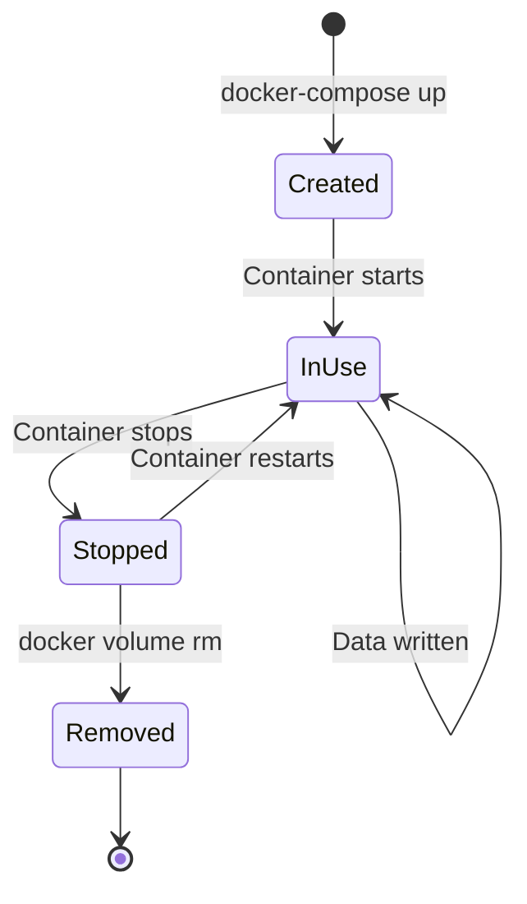

# Volume Specification

## Overview

The sandbox uses Docker named volumes exclusively to provide data persistence while maintaining strict isolation from the host filesystem.

## Volume Architecture

```mermaid
graph TB
    subgraph "Docker Host"
        VolDriver[Volume Driver]
    end

    subgraph "Named Volumes"
        Data[automaker-data]
        Claude[automaker-claude-config]
        Cursor[automaker-cursor-config]
        OC1[automaker-opencode-data]
        OC2[automaker-opencode-config]
        OC3[automaker-opencode-cache]
    end

    subgraph "Container Mounts"
        MData[/data]
        MClaude[/home/automaker/.claude]
        MCursor[/home/automaker/.cursor]
        MOC1[/home/automaker/.local/share/opencode]
        MOC2[/home/automaker/.config/opencode]
        MOC3[/home/automaker/.cache/opencode]
    end

    VolDriver --> Data
    VolDriver --> Claude
    VolDriver --> Cursor
    VolDriver --> OC1
    VolDriver --> OC2
    VolDriver --> OC3

    Data --> MData
    Claude --> MClaude
    Cursor --> MCursor
    OC1 --> MOC1
    OC2 --> MOC2
    OC3 --> MOC3
```

## Volume Definitions

### automaker-data

**Purpose**: Primary data storage for sessions, settings, and project metadata.

| Property | Value |
|----------|-------|
| Mount point | `/data` |
| Environment | `DATA_DIR=/data` |
| Owner | `automaker:automaker` |

**Contents**:
```
/data/
├── settings.json          # Global settings
├── credentials.json       # API keys
├── sessions-metadata.json # Chat session metadata
└── agent-sessions/        # Conversation histories
    └── {sessionId}/
        └── messages.json
```

### automaker-claude-config

**Purpose**: Claude CLI configuration and OAuth tokens.

| Property | Value |
|----------|-------|
| Mount point | `/home/automaker/.claude` |
| Owner | `automaker:automaker` |
| Permissions | `700` (directory), `600` (files) |

**Contents**:
```
/home/automaker/.claude/
├── .credentials.json      # OAuth tokens
├── settings.json          # CLI settings
└── projects/              # Session data
```

### automaker-cursor-config

**Purpose**: Cursor CLI configuration and authentication.

| Property | Value |
|----------|-------|
| Mount point | `/home/automaker/.cursor` |
| Owner | `automaker:automaker` |
| Permissions | `700` |

**Contents**:
```
/home/automaker/.cursor/
└── (cursor-agent configuration)
```

### automaker-opencode-data

**Purpose**: OpenCode CLI data and authentication.

| Property | Value |
|----------|-------|
| Mount point | `/home/automaker/.local/share/opencode` |
| Owner | `automaker:automaker` |
| Permissions | `700` |

**Contents**:
```
/home/automaker/.local/share/opencode/
├── auth.json              # Authentication tokens
└── (provider-specific data)
```

### automaker-opencode-config

**Purpose**: OpenCode user configuration.

| Property | Value |
|----------|-------|
| Mount point | `/home/automaker/.config/opencode` |
| Owner | `automaker:automaker` |
| Permissions | `700` |

### automaker-opencode-cache

**Purpose**: OpenCode cache data.

| Property | Value |
|----------|-------|
| Mount point | `/home/automaker/.cache/opencode` |
| Owner | `automaker:automaker` |
| Permissions | `700` |

**Contents**:
```
/home/automaker/.cache/opencode/
├── version                # CLI version info
└── (cached data)
```

## Security Model

### Named Volumes vs Bind Mounts

| Aspect | Named Volume | Bind Mount |
|--------|--------------|------------|
| Location | Docker-managed | User-specified |
| Host access | Indirect | Direct |
| Isolation | Strong | Weak |
| Portability | High | Low |
| Security | Better | Worse |

### Why Named Volumes Only

1. **No host filesystem exposure**: Data exists only within Docker
2. **Consistent permissions**: Docker manages ownership
3. **Portable**: Same behavior across hosts
4. **Backup-friendly**: Easy to backup/restore

### Never Use Bind Mounts

```yaml
# ❌ DANGEROUS - exposes host filesystem
volumes:
  - /home/user/projects:/projects
  - ./data:/data

# ✅ SECURE - Docker-managed volumes
volumes:
  - automaker-data:/data
```

## Volume Operations

### List Volumes

```bash
docker volume ls | grep automaker

# Output:
# local     automaker-data
# local     automaker-claude-config
# local     automaker-cursor-config
# local     automaker-opencode-data
# local     automaker-opencode-config
# local     automaker-opencode-cache
```

### Inspect Volume

```bash
docker volume inspect automaker-data

# Output:
# [
#     {
#         "CreatedAt": "2024-01-15T10:30:00Z",
#         "Driver": "local",
#         "Labels": {
#             "com.docker.compose.project": "automaker",
#             "com.docker.compose.volume": "automaker-data"
#         },
#         "Mountpoint": "/var/lib/docker/volumes/automaker-data/_data",
#         "Name": "automaker-data",
#         "Options": null,
#         "Scope": "local"
#     }
# ]
```

### Backup Volume

```bash
# Backup to tar file
docker run --rm \
  -v automaker-data:/data \
  -v $(pwd):/backup \
  alpine tar czf /backup/automaker-data.tar.gz -C /data .

# Backup all volumes
for vol in automaker-data automaker-claude-config automaker-cursor-config; do
  docker run --rm -v $vol:/vol -v $(pwd):/backup \
    alpine tar czf /backup/$vol.tar.gz -C /vol .
done
```

### Restore Volume

```bash
# Restore from tar file
docker run --rm \
  -v automaker-data:/data \
  -v $(pwd):/backup \
  alpine tar xzf /backup/automaker-data.tar.gz -C /data
```

### View Volume Contents

```bash
# Using a temporary container
docker run --rm -v automaker-data:/data alpine ls -la /data

# Interactive exploration
docker run --rm -it -v automaker-data:/data alpine sh
```

### Remove Volume

```bash
# Remove single volume (data loss!)
docker volume rm automaker-data

# Remove all automaker volumes
docker volume rm $(docker volume ls -q | grep automaker)

# Remove with compose
docker-compose down -v
```

## Permission Handling

### UID/GID Matching

Build with matching user IDs:

```bash
# Match host user
docker-compose build --build-arg UID=$(id -u) --build-arg GID=$(id -g)
```

### Entrypoint Permission Setup

The entrypoint script ensures correct ownership:

```bash
# In docker-entrypoint.sh
chown -R automaker:automaker /home/automaker/.claude
chmod 700 /home/automaker/.claude
```

### Troubleshooting Permissions

```bash
# Check ownership inside container
docker-compose exec server ls -la /data
docker-compose exec server ls -la /home/automaker/.claude

# Fix permissions manually
docker-compose exec -u root server chown -R automaker:automaker /data
```

## Volume Lifecycle



### Persistence Behavior

| Event | Volumes | Data |
|-------|---------|------|
| Container stop | Preserved | Preserved |
| Container remove | Preserved | Preserved |
| `docker-compose down` | Preserved | Preserved |
| `docker-compose down -v` | Removed | Lost |
| `docker volume rm` | Removed | Lost |

## Data Recovery

### From Running Container

```bash
# Copy files out
docker cp automaker-server:/data/settings.json ./settings-backup.json
```

### From Stopped Container

```bash
# Start temporary container with volume
docker run --rm -v automaker-data:/data alpine cat /data/settings.json
```

### From Volume Backup

```bash
# Restore backup
docker run --rm \
  -v automaker-data:/data \
  -v $(pwd):/backup \
  alpine tar xzf /backup/automaker-data.tar.gz -C /data
```

## Related Documents

- [Compose](./compose.md) - Docker Compose configuration
- [Dockerfile](./dockerfile.md) - Container build
- [Entrypoint](./entrypoint.md) - Permission setup
