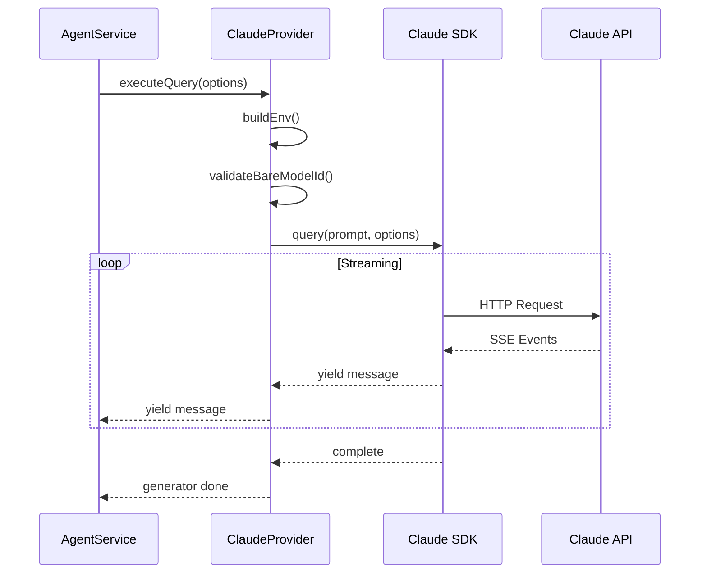

# Claude Provider Specification

## Overview

The `ClaudeProvider` class wraps the `@anthropic-ai/claude-agent-sdk` to provide seamless integration with the sandbox's provider architecture.

## Class Definition

```typescript
import { query, type Options } from '@anthropic-ai/claude-agent-sdk';
import { BaseProvider } from './base-provider.js';

export class ClaudeProvider extends BaseProvider {
  getName(): string {
    return 'claude';
  }

  async *executeQuery(options: ExecuteOptions): AsyncGenerator<ProviderMessage>;
  async detectInstallation(): Promise<InstallationStatus>;
  getAvailableModels(): ModelDefinition[];
  supportsFeature(feature: string): boolean;
}
```

## Provider Architecture

```mermaid
graph TB
    subgraph "Provider Layer"
        Base[BaseProvider]
        Claude[ClaudeProvider]
    end

    subgraph "SDK Layer"
        SDK[@anthropic-ai/claude-agent-sdk]
        Query[query function]
    end

    subgraph "External"
        API[Claude API]
    end

    Base --> Claude
    Claude --> SDK
    SDK --> Query
    Query --> API
```

## Execute Options

```typescript
interface ExecuteOptions {
  prompt: string | MultiPartPrompt[];
  model: string;
  cwd: string;
  systemPrompt?: string;
  maxTurns?: number;
  allowedTools?: string[];
  abortController?: AbortController;
  conversationHistory?: Message[];
  sdkSessionId?: string;
  thinkingLevel?: ThinkingLevel;
  settingSources?: string[];
  mcpServers?: MCPServerConfig[];
  agents?: AgentConfig[];
  outputFormat?: OutputFormat;
}
```

| Option | Type | Required | Description |
|--------|------|----------|-------------|
| `prompt` | `string \| MultiPartPrompt[]` | Yes | User message (text or with images) |
| `model` | `string` | Yes | Claude model ID (bare, no prefix) |
| `cwd` | `string` | Yes | Working directory for tools |
| `systemPrompt` | `string` | No | System prompt to prepend |
| `maxTurns` | `number` | No | Maximum agentic turns (default: 20) |
| `allowedTools` | `string[]` | No | Whitelist of allowed tools |
| `abortController` | `AbortController` | No | For cancellation |
| `sdkSessionId` | `string` | No | For session resume |
| `thinkingLevel` | `ThinkingLevel` | No | Extended thinking budget |
| `settingSources` | `string[]` | No | CLAUDE.md file paths |
| `mcpServers` | `MCPServerConfig[]` | No | MCP server configs |
| `agents` | `AgentConfig[]` | No | Subagent configs |
| `outputFormat` | `OutputFormat` | No | JSON output schema |

## Environment Filtering

```typescript
const ALLOWED_ENV_VARS = [
  'ANTHROPIC_API_KEY',
  'ANTHROPIC_BASE_URL',
  'ANTHROPIC_AUTH_TOKEN',
  'PATH',
  'HOME',
  'SHELL',
  'TERM',
  'USER',
  'LANG',
  'LC_ALL',
];

function buildEnv(): Record<string, string | undefined> {
  const env: Record<string, string | undefined> = {};
  for (const key of ALLOWED_ENV_VARS) {
    if (process.env[key]) {
      env[key] = process.env[key];
    }
  }
  return env;
}
```

### Why These Variables?

| Variable | Reason |
|----------|--------|
| `ANTHROPIC_API_KEY` | API authentication |
| `ANTHROPIC_BASE_URL` | Custom API endpoint |
| `ANTHROPIC_AUTH_TOKEN` | Alternative auth method |
| `PATH` | Tool execution needs PATH |
| `HOME` | User home directory |
| `SHELL` | Default shell for commands |
| `TERM` | Terminal type for PTY |
| `USER` | Current user name |
| `LANG`, `LC_ALL` | Locale settings |

### Variables NOT Passed

| Variable | Reason Excluded |
|----------|-----------------|
| `DATA_DIR` | Internal server config |
| `PORT` | Would interfere with user's apps |
| `AUTOMAKER_API_KEY` | Internal authentication |
| `DATABASE_URL` | Security risk |
| `AWS_*`, `GH_*` | Potentially sensitive |

## Autonomous Mode Configuration

```typescript
const sdkOptions: Options = {
  model,
  systemPrompt,
  maxTurns,
  cwd,
  env: buildEnv(),
  ...(allowedTools && { allowedTools }),

  // AUTONOMOUS MODE
  permissionMode: 'bypassPermissions',
  allowDangerouslySkipPermissions: true,

  abortController,
  ...(sdkSessionId && conversationHistory?.length > 0
    ? { resume: sdkSessionId }
    : {}),
  ...(settingSources && { settingSources }),
  ...(mcpServers && { mcpServers }),
  ...(maxThinkingTokens && { maxThinkingTokens }),
  ...(agents && { agents }),
  ...(outputFormat && { outputFormat }),
};
```

### Permission Mode

| Mode | Behavior |
|------|----------|
| `'default'` | Interactive approval for tools |
| `'bypassPermissions'` | Skip all approval prompts |

### Why Bypass Permissions?

1. **Infrastructure security**: All security is at container/path level
2. **Autonomous execution**: Agent must work without human intervention
3. **User consent model**: Consent given at task creation, not tool execution
4. **Sandbox guarantee**: Container isolation prevents host damage

## Multi-Part Prompt Handling

```typescript
let promptPayload: string | AsyncIterable<any>;

if (Array.isArray(prompt)) {
  // Multi-part prompt (with images)
  promptPayload = (async function* () {
    const multiPartPrompt = {
      type: 'user' as const,
      session_id: '',
      message: {
        role: 'user' as const,
        content: prompt,
      },
      parent_tool_use_id: null,
    };
    yield multiPartPrompt;
  })();
} else {
  // Simple text prompt
  promptPayload = prompt;
}
```

## Execute Query Implementation

```typescript
async *executeQuery(options: ExecuteOptions): AsyncGenerator<ProviderMessage> {
  validateBareModelId(options.model, 'ClaudeProvider');

  const { prompt, model, cwd, ... } = options;
  const maxThinkingTokens = getThinkingTokenBudget(thinkingLevel);

  const sdkOptions: Options = { /* ... */ };
  const promptPayload = buildPromptPayload(prompt);

  try {
    const stream = query({ prompt: promptPayload, options: sdkOptions });

    // Stream messages directly
    for await (const msg of stream) {
      yield msg as ProviderMessage;
    }
  } catch (error) {
    const errorInfo = classifyError(error);
    const userMessage = getUserFriendlyErrorMessage(error);

    logger.error('executeQuery() error:', {
      type: errorInfo.type,
      message: errorInfo.message,
      isRateLimit: errorInfo.isRateLimit,
    });

    const enhancedError = new Error(
      errorInfo.isRateLimit
        ? `${userMessage}\n\nTip: Consider reducing concurrency.`
        : userMessage
    );
    (enhancedError as any).type = errorInfo.type;

    throw enhancedError;
  }
}
```

## Error Handling

### Error Classification

```typescript
const errorInfo = classifyError(error);
// Returns:
// {
//   type: 'rate_limit' | 'auth' | 'network' | 'server' | 'unknown',
//   message: string,
//   isRateLimit: boolean,
//   retryAfter?: number
// }
```

### Rate Limit Handling

```typescript
if (errorInfo.isRateLimit) {
  (enhancedError as any).retryAfter = errorInfo.retryAfter;
  message += '\n\nTip: Consider reducing concurrency.';
}
```

## Installation Detection

```typescript
async detectInstallation(): Promise<InstallationStatus> {
  const hasApiKey = !!process.env.ANTHROPIC_API_KEY;

  return {
    installed: true,       // SDK is npm dependency
    method: 'sdk',
    hasApiKey,
    authenticated: hasApiKey,
  };
}
```

## Available Models

```typescript
getAvailableModels(): ModelDefinition[] {
  return [
    {
      id: 'claude-opus-4-5-20251101',
      name: 'Claude Opus 4.5',
      modelString: 'claude-opus-4-5-20251101',
      provider: 'anthropic',
      description: 'Most capable Claude model',
      contextWindow: 200000,
      maxOutputTokens: 16000,
      supportsVision: true,
      supportsTools: true,
      tier: 'premium',
      default: true,
    },
    {
      id: 'claude-sonnet-4-20250514',
      name: 'Claude Sonnet 4',
      modelString: 'claude-sonnet-4-20250514',
      provider: 'anthropic',
      description: 'Balanced performance and cost',
      contextWindow: 200000,
      maxOutputTokens: 16000,
      supportsVision: true,
      supportsTools: true,
      tier: 'standard',
    },
    // ... more models
  ];
}
```

## Feature Support

```typescript
supportsFeature(feature: string): boolean {
  const supportedFeatures = ['tools', 'text', 'vision', 'thinking'];
  return supportedFeatures.includes(feature);
}
```

| Feature | Supported | Description |
|---------|-----------|-------------|
| `tools` | Yes | Tool/function calling |
| `text` | Yes | Text generation |
| `vision` | Yes | Image understanding |
| `thinking` | Yes | Extended thinking |

## Integration Diagram



## Related Documents

- [Streaming](./streaming.md) - AsyncGenerator patterns
- [Session Continuity](./session-continuity.md) - Resume behavior
- [Tool Execution](./tool-execution.md) - Tool definitions
- [Environment Variables](../security/environment-variables.md) - Env filtering
