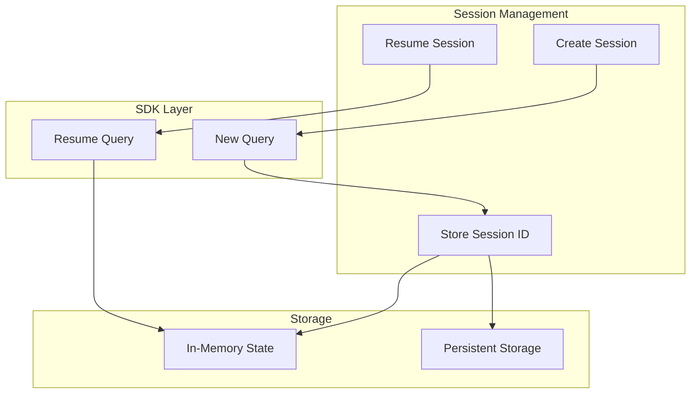
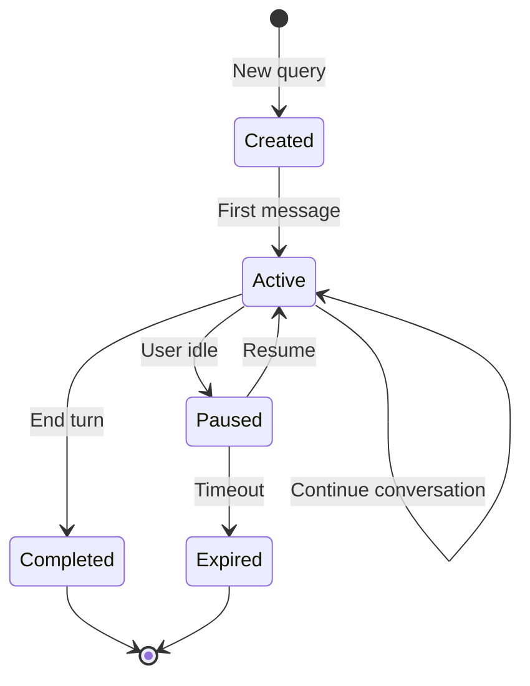

# Session Continuity Specification

## Overview

Session continuity enables Claude agents to resume interrupted conversations and maintain context across multiple interactions using the `sdkSessionId` and `resume` mechanism.

## Session Architecture



## Session ID Flow

### New Session

```typescript
// First query - no session ID
const options: ExecuteOptions = {
  prompt: 'Hello',
  model: 'claude-sonnet-4-20250514',
  cwd: '/projects/my-app',
  // No sdkSessionId - creates new session
};

const generator = provider.executeQuery(options);

for await (const message of generator) {
  if (message.type === 'result') {
    // Store session ID for future use
    const sessionId = message.session_id;
    saveSessionId(sessionId);
  }
}
```

### Resume Session

```typescript
// Subsequent query - with session ID
const options: ExecuteOptions = {
  prompt: 'Continue from where we left off',
  model: 'claude-sonnet-4-20250514',
  cwd: '/projects/my-app',
  sdkSessionId: savedSessionId,
  conversationHistory: previousMessages,
};
```

## SDK Options Configuration

```typescript
const sdkOptions: Options = {
  model,
  systemPrompt,
  maxTurns,
  cwd,
  env: buildEnv(),
  permissionMode: 'bypassPermissions',
  allowDangerouslySkipPermissions: true,

  // Session resume configuration
  ...(sdkSessionId && conversationHistory && conversationHistory.length > 0
    ? { resume: sdkSessionId }
    : {}),
};
```

### Resume Condition

The session is resumed only when:
1. `sdkSessionId` is provided
2. `conversationHistory` exists AND
3. `conversationHistory.length > 0`

```typescript
// Resume triggers
const shouldResume =
  sdkSessionId !== undefined &&
  conversationHistory !== undefined &&
  conversationHistory.length > 0;

if (shouldResume) {
  sdkOptions.resume = sdkSessionId;
}
```

## Session Storage

### In-Memory State

```typescript
interface SessionState {
  sessionId: string;
  model: string;
  cwd: string;
  createdAt: Date;
  lastMessageAt: Date;
  messageCount: number;
}

const sessionCache = new Map<string, SessionState>();

function cacheSession(sessionId: string, state: SessionState): void {
  sessionCache.set(sessionId, state);
}
```

### Persistent Storage

```typescript
// Storage path: DATA_DIR/agent-sessions/{sessionId}/
interface PersistedSession {
  id: string;
  metadata: {
    model: string;
    cwd: string;
    createdAt: string;
    lastMessageAt: string;
  };
  messages: Message[];
}

async function persistSession(session: PersistedSession): Promise<void> {
  const dir = path.join(DATA_DIR, 'agent-sessions', session.id);
  await secureFs.mkdir(dir, { recursive: true });
  await secureFs.writeFile(
    path.join(dir, 'session.json'),
    JSON.stringify(session, null, 2)
  );
}
```

## Message History

### Message Types

```typescript
interface Message {
  role: 'user' | 'assistant';
  content: ContentBlock[];
  timestamp?: string;
}

interface ContentBlock {
  type: 'text' | 'tool_use' | 'tool_result';
  text?: string;
  tool_use?: ToolUse;
  tool_result?: ToolResult;
}
```

### History Accumulation

```typescript
class ConversationHistory {
  private messages: Message[] = [];

  addUserMessage(content: string): void {
    this.messages.push({
      role: 'user',
      content: [{ type: 'text', text: content }],
      timestamp: new Date().toISOString(),
    });
  }

  addAssistantMessage(content: ContentBlock[]): void {
    this.messages.push({
      role: 'assistant',
      content,
      timestamp: new Date().toISOString(),
    });
  }

  getMessages(): Message[] {
    return [...this.messages];
  }
}
```

## Session Lifecycle



### State Transitions

| From | To | Trigger |
|------|-----|---------|
| - | Created | `executeQuery()` without session ID |
| Created | Active | First message received |
| Active | Active | Subsequent messages |
| Active | Paused | No activity for threshold |
| Paused | Active | Resume with session ID |
| Paused | Expired | Timeout exceeded |
| Active | Completed | `end_turn` stop reason |

## Session Expiration

### Timeout Configuration

```typescript
const SESSION_TIMEOUT_MS = 30 * 60 * 1000; // 30 minutes

function isSessionExpired(session: SessionState): boolean {
  const now = Date.now();
  const lastActivity = session.lastMessageAt.getTime();
  return now - lastActivity > SESSION_TIMEOUT_MS;
}
```

### Cleanup

```typescript
async function cleanupExpiredSessions(): Promise<void> {
  for (const [sessionId, state] of sessionCache.entries()) {
    if (isSessionExpired(state)) {
      sessionCache.delete(sessionId);
      await archiveSession(sessionId);
    }
  }
}

// Run periodically
setInterval(cleanupExpiredSessions, 5 * 60 * 1000);
```

## Error Recovery

### Resume Failure

```typescript
async function safeResume(
  sessionId: string,
  prompt: string,
  options: ExecuteOptions
): Promise<AsyncGenerator<ProviderMessage>> {
  try {
    // Try to resume
    return provider.executeQuery({
      ...options,
      sdkSessionId: sessionId,
    });
  } catch (error) {
    if (isSessionNotFoundError(error)) {
      // Session expired or invalid, start fresh
      logger.warn(`Session ${sessionId} not found, starting new session`);
      return provider.executeQuery({
        ...options,
        sdkSessionId: undefined,
        conversationHistory: undefined,
      });
    }
    throw error;
  }
}
```

### Context Reconstruction

```typescript
async function reconstructContext(sessionId: string): Promise<Message[]> {
  const persisted = await loadPersistedSession(sessionId);

  if (!persisted) {
    return [];
  }

  // Validate messages are still relevant
  return persisted.messages.filter(msg => {
    // Filter out stale tool results
    if (msg.role === 'assistant') {
      return msg.content.every(block =>
        block.type !== 'tool_result' || isToolResultValid(block)
      );
    }
    return true;
  });
}
```

## Multi-Turn Behavior

### Turn Counting

```typescript
interface TurnState {
  currentTurn: number;
  maxTurns: number;
  toolCallsThisTurn: number;
}

function shouldContinue(state: TurnState): boolean {
  return state.currentTurn < state.maxTurns;
}
```

### Automatic Continuation

```typescript
async function* executeWithContinuation(
  options: ExecuteOptions
): AsyncGenerator<ProviderMessage> {
  let turnCount = 0;
  const maxTurns = options.maxTurns ?? 20;

  while (turnCount < maxTurns) {
    const generator = provider.executeQuery(options);

    for await (const message of generator) {
      yield message;

      if (message.type === 'result') {
        if (message.result.stop_reason === 'end_turn') {
          return; // Natural completion
        }
        if (message.result.stop_reason === 'tool_use') {
          turnCount++;
          continue; // Continue to next turn
        }
      }
    }
  }
}
```

## Session Metadata

### Tracked Information

```typescript
interface SessionMetadata {
  id: string;
  model: string;
  cwd: string;

  // Timing
  createdAt: string;
  lastMessageAt: string;

  // Statistics
  messageCount: number;
  turnCount: number;
  totalInputTokens: number;
  totalOutputTokens: number;

  // State
  status: 'active' | 'paused' | 'completed' | 'expired';
  lastStopReason?: string;
}
```

### Metadata Updates

```typescript
function updateSessionMetadata(
  sessionId: string,
  result: ResultEvent
): void {
  const metadata = sessionMetadata.get(sessionId);

  if (metadata) {
    metadata.lastMessageAt = new Date().toISOString();
    metadata.messageCount++;
    metadata.totalInputTokens += result.result.usage.input_tokens;
    metadata.totalOutputTokens += result.result.usage.output_tokens;
    metadata.lastStopReason = result.result.stop_reason;

    if (result.result.stop_reason === 'end_turn') {
      metadata.status = 'completed';
    }
  }
}
```

## Related Documents

- [Provider](./provider.md) - ClaudeProvider implementation
- [Streaming](./streaming.md) - Event streaming patterns
- [Tool Execution](./tool-execution.md) - Tool definitions
