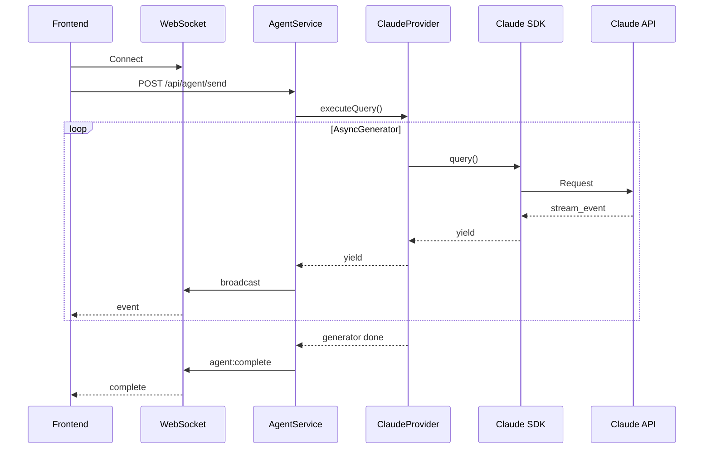

# Streaming Specification

## Overview

The sandbox uses AsyncGenerator patterns to stream events from the Claude Agent SDK to the frontend in real-time.

## Event Flow



## Event Types

### stream_event

Token streaming events for real-time text display.

```typescript
interface StreamEvent {
  type: 'stream_event';
  event: {
    type: 'content_block_delta';
    delta: {
      type: 'text_delta';
      text: string;
    };
  };
}
```

### assistant_message

Complete assistant turn message.

```typescript
interface AssistantMessage {
  type: 'assistant_message';
  message: {
    role: 'assistant';
    content: ContentBlock[];
  };
  session_id: string;
}
```

### tool_use

Tool invocation request.

```typescript
interface ToolUseEvent {
  type: 'tool_use';
  tool_use: {
    id: string;
    name: string;
    input: Record<string, unknown>;
  };
}
```

### tool_result

Tool execution result.

```typescript
interface ToolResultEvent {
  type: 'tool_result';
  tool_result: {
    tool_use_id: string;
    content: string | ContentBlock[];
    is_error?: boolean;
  };
}
```

### result

Final completion result.

```typescript
interface ResultEvent {
  type: 'result';
  result: {
    stop_reason: 'end_turn' | 'max_tokens' | 'tool_use';
    usage: {
      input_tokens: number;
      output_tokens: number;
    };
  };
  session_id: string;
}
```

## AsyncGenerator Pattern

### Provider Implementation

```typescript
async *executeQuery(options: ExecuteOptions): AsyncGenerator<ProviderMessage> {
  const stream = query({ prompt, options: sdkOptions });

  for await (const msg of stream) {
    yield msg as ProviderMessage;
  }
}
```

### Consumer Pattern

```typescript
async function processAgentQuery(options: ExecuteOptions): Promise<void> {
  const generator = provider.executeQuery(options);

  for await (const message of generator) {
    switch (message.type) {
      case 'stream_event':
        broadcast('agent:stream', { text: message.event.delta.text });
        break;

      case 'tool_use':
        broadcast('agent:tool_use', { tool: message.tool_use });
        break;

      case 'tool_result':
        broadcast('agent:tool_result', { result: message.tool_result });
        break;

      case 'result':
        broadcast('agent:complete', { result: message.result });
        break;
    }
  }
}
```

## Cancellation

### AbortController Usage

```typescript
const controller = new AbortController();

const options: ExecuteOptions = {
  // ...
  abortController: controller,
};

// Start streaming
const generator = provider.executeQuery(options);

// Cancel later
controller.abort();
```

### Cleanup on Abort

```typescript
try {
  for await (const message of generator) {
    // Process messages
  }
} catch (error) {
  if (error.name === 'AbortError') {
    logger.info('Query cancelled by user');
    broadcast('agent:cancelled', {});
  } else {
    throw error;
  }
} finally {
  // Cleanup resources
}
```

## Backpressure Handling

### WebSocket Buffering

```typescript
class EventBuffer {
  private buffer: ProviderMessage[] = [];
  private flushInterval: NodeJS.Timeout;

  constructor(private ws: WebSocket, private intervalMs: number = 50) {
    this.flushInterval = setInterval(() => this.flush(), intervalMs);
  }

  add(message: ProviderMessage): void {
    this.buffer.push(message);
  }

  private flush(): void {
    if (this.buffer.length === 0) return;

    const batch = this.buffer;
    this.buffer = [];

    this.ws.send(JSON.stringify({
      type: 'batch',
      messages: batch,
    }));
  }
}
```

### Rate Limiting

```typescript
const OUTPUT_THROTTLE_MS = 4;  // ~250fps max
const OUTPUT_BATCH_SIZE = 4096;

function throttledBroadcast(data: string): void {
  outputBuffer += data;

  if (!flushTimeout) {
    flushTimeout = setTimeout(() => {
      if (outputBuffer.length > OUTPUT_BATCH_SIZE) {
        // Send in chunks
        const chunk = outputBuffer.slice(0, OUTPUT_BATCH_SIZE);
        outputBuffer = outputBuffer.slice(OUTPUT_BATCH_SIZE);
        broadcast(chunk);
        flushTimeout = setTimeout(throttledBroadcast, OUTPUT_THROTTLE_MS);
      } else {
        broadcast(outputBuffer);
        outputBuffer = '';
        flushTimeout = null;
      }
    }, OUTPUT_THROTTLE_MS);
  }
}
```

## Error Handling

### Generator Error Propagation

```typescript
async *executeQuery(options: ExecuteOptions): AsyncGenerator<ProviderMessage> {
  try {
    const stream = query({ prompt, options: sdkOptions });

    for await (const msg of stream) {
      yield msg;
    }
  } catch (error) {
    const errorInfo = classifyError(error);

    // Yield error event before throwing
    yield {
      type: 'error',
      error: {
        message: errorInfo.message,
        type: errorInfo.type,
        retryAfter: errorInfo.retryAfter,
      },
    };

    throw error;
  }
}
```

### Consumer Error Handling

```typescript
try {
  for await (const message of generator) {
    if (message.type === 'error') {
      broadcast('agent:error', message.error);
      continue;
    }
    // Handle other messages
  }
} catch (error) {
  broadcast('agent:error', {
    message: error.message,
    recoverable: false,
  });
}
```

## WebSocket Broadcast

### Event Format

```typescript
interface WebSocketEvent {
  type: string;
  payload: unknown;
  timestamp: number;
  sessionId?: string;
}

function broadcast(type: string, payload: unknown): void {
  const event: WebSocketEvent = {
    type,
    payload,
    timestamp: Date.now(),
  };

  wss.clients.forEach(client => {
    if (client.readyState === WebSocket.OPEN) {
      client.send(JSON.stringify(event));
    }
  });
}
```

### Event Types Broadcast

| Event Type | Payload | Description |
|------------|---------|-------------|
| `agent:stream` | `{ text: string }` | Token delta |
| `agent:tool_use` | `{ tool: ToolUse }` | Tool invocation |
| `agent:tool_result` | `{ result: ToolResult }` | Tool output |
| `agent:complete` | `{ result: Result }` | Query complete |
| `agent:error` | `{ message: string }` | Error occurred |
| `agent:cancelled` | `{}` | Query cancelled |

## Performance Considerations

### Memory Management

```typescript
// Don't accumulate all messages in memory
async function processStream(generator: AsyncGenerator<ProviderMessage>): Promise<void> {
  // ✅ Process and discard immediately
  for await (const message of generator) {
    processMessage(message);
    // Message is eligible for GC after this iteration
  }

  // ❌ Don't collect all messages
  // const allMessages = [];
  // for await (const msg of generator) {
  //   allMessages.push(msg);  // Memory grows unbounded
  // }
}
```

### Token Streaming

```typescript
// Efficient token accumulation for display
class TokenAccumulator {
  private tokens: string[] = [];
  private fullText = '';

  add(text: string): string {
    this.tokens.push(text);
    this.fullText += text;
    return this.fullText;
  }

  // Only rebuild when needed
  getText(): string {
    if (this.tokens.length > 100) {
      this.fullText = this.tokens.join('');
      this.tokens = [this.fullText];
    }
    return this.fullText;
  }
}
```

## Related Documents

- [Provider](./provider.md) - ClaudeProvider implementation
- [Session Continuity](./session-continuity.md) - Resume behavior
- [Tool Execution](./tool-execution.md) - Tool definitions
