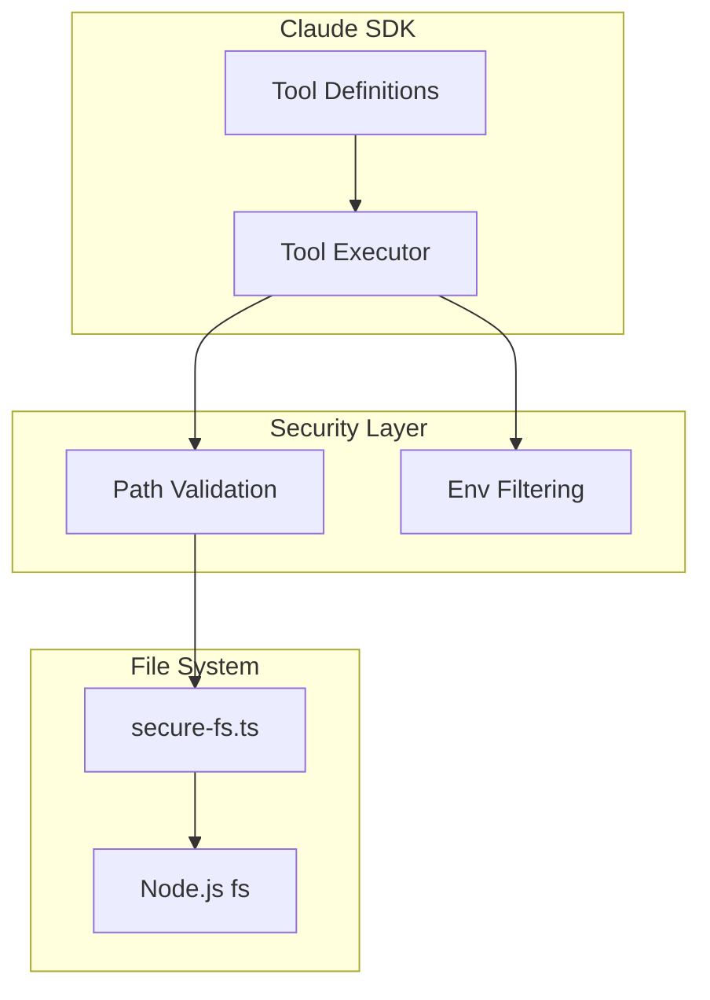
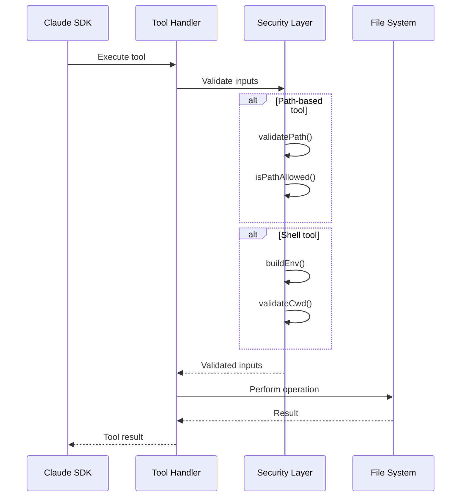

# Tool Execution Specification

## Overview

The Claude Agent SDK provides a set of built-in tools that enable file operations, shell commands, and code exploration. All tools execute within the sandbox's security boundaries.

## Tool Architecture



## Available Tools

### File Operations

| Tool | Description | Security |
|------|-------------|----------|
| `Read` | Read file contents | Path validated |
| `Write` | Write file contents | Path validated |
| `Edit` | Edit file with patches | Path validated |
| `MultiEdit` | Multiple file edits | Path validated |

### Directory Operations

| Tool | Description | Security |
|------|-------------|----------|
| `Glob` | Find files by pattern | Path validated |
| `Grep` | Search file contents | Path validated |
| `LS` | List directory contents | Path validated |

### Shell Operations

| Tool | Description | Security |
|------|-------------|----------|
| `Bash` | Execute shell commands | Env filtered, cwd validated |
| `Task` | Run background tasks | Env filtered |

### Notebook Operations

| Tool | Description | Security |
|------|-------------|----------|
| `NotebookRead` | Read Jupyter notebooks | Path validated |
| `NotebookEdit` | Edit Jupyter notebooks | Path validated |

## Tool Allowlisting

### Configuration

```typescript
const allowedTools: string[] = [
  'Read',
  'Write',
  'Edit',
  'Glob',
  'Grep',
  'Bash',
  // Exclude dangerous tools if needed
];

const sdkOptions: Options = {
  // ...
  allowedTools,
};
```

### Default Tools

When no `allowedTools` specified, all built-in tools are available.

## Security Integration

### Path Validation

All file-based tools route through the secure file system adapter:

```typescript
// In tool execution
async function readFileTool(filePath: string): Promise<string> {
  // validatePath throws if path is outside allowed boundaries
  const validatedPath = validatePath(filePath);
  return secureFs.readFile(validatedPath, 'utf-8');
}
```

### Environment Filtering

Shell tools receive filtered environment:

```typescript
async function bashTool(command: string, cwd: string): Promise<string> {
  const env = buildEnv(); // Only allowed vars

  return spawn(command, {
    cwd: validatePath(cwd),
    env,
    shell: true,
  });
}
```

## Tool Input/Output

### Read Tool

```typescript
interface ReadInput {
  path: string;
  encoding?: 'utf-8' | 'base64';
}

interface ReadOutput {
  content: string;
  size: number;
  encoding: string;
}
```

### Write Tool

```typescript
interface WriteInput {
  path: string;
  content: string;
  encoding?: 'utf-8' | 'base64';
}

interface WriteOutput {
  success: boolean;
  bytesWritten: number;
}
```

### Edit Tool

```typescript
interface EditInput {
  path: string;
  old_string: string;
  new_string: string;
}

interface EditOutput {
  success: boolean;
  replacements: number;
}
```

### Glob Tool

```typescript
interface GlobInput {
  pattern: string;
  cwd?: string;
}

interface GlobOutput {
  files: string[];
  count: number;
}
```

### Grep Tool

```typescript
interface GrepInput {
  pattern: string;
  path?: string;
  include?: string;
  exclude?: string;
}

interface GrepOutput {
  matches: Array<{
    file: string;
    line: number;
    content: string;
  }>;
}
```

### Bash Tool

```typescript
interface BashInput {
  command: string;
  cwd?: string;
  timeout?: number;
}

interface BashOutput {
  stdout: string;
  stderr: string;
  exitCode: number;
}
```

## Tool Execution Flow



## Error Handling

### Path Errors

```typescript
try {
  const content = await secureFs.readFile(path);
  return { content };
} catch (error) {
  if (error instanceof PathNotAllowedError) {
    return {
      error: `Access denied: Path ${path} is outside allowed boundaries`,
      is_error: true,
    };
  }
  throw error;
}
```

### Shell Errors

```typescript
try {
  const result = await spawn(command, { cwd, env });
  return {
    stdout: result.stdout,
    stderr: result.stderr,
    exitCode: result.exitCode,
  };
} catch (error) {
  return {
    stdout: '',
    stderr: error.message,
    exitCode: 1,
    is_error: true,
  };
}
```

## Timeout Handling

### Default Timeouts

| Tool | Default Timeout |
|------|-----------------|
| `Read` | 30s |
| `Write` | 30s |
| `Bash` | 120s |
| `Task` | No timeout |

### Custom Timeout

```typescript
const result = await bashTool({
  command: 'npm install',
  cwd: '/projects/app',
  timeout: 300000, // 5 minutes
});
```

## Concurrency Control

### File Operation Limits

```typescript
// From secure-fs.ts
const DEFAULT_CONFIG = {
  maxConcurrency: 100,
  maxRetries: 3,
  baseDelay: 100,
  maxDelay: 5000,
};

const fsLimit = pLimit(config.maxConcurrency);
```

### Retry Logic

```typescript
async function executeWithRetry<T>(
  operation: () => Promise<T>
): Promise<T> {
  return fsLimit(async () => {
    for (let attempt = 0; attempt <= config.maxRetries; attempt++) {
      try {
        return await operation();
      } catch (error) {
        if (isFileDescriptorError(error) && attempt < config.maxRetries) {
          const delay = calculateDelay(attempt);
          await sleep(delay);
          continue;
        }
        throw error;
      }
    }
    throw new Error('Max retries exceeded');
  });
}
```

## Tool Events

### WebSocket Events

```typescript
// Tool use event
{
  type: 'agent:tool_use',
  payload: {
    id: 'tool_use_123',
    name: 'Read',
    input: { path: '/projects/app/src/index.ts' }
  }
}

// Tool result event
{
  type: 'agent:tool_result',
  payload: {
    tool_use_id: 'tool_use_123',
    content: '// File contents...',
    is_error: false
  }
}
```

## Best Practices

### Tool Selection

1. Use `Glob` for finding files by pattern
2. Use `Grep` for searching content
3. Use `Read` for reading specific files
4. Use `Edit` for precise modifications
5. Use `Bash` sparingly for complex operations

### Error Recovery

1. Check for `is_error` in tool results
2. Provide clear error messages to the agent
3. Retry transient failures automatically
4. Fail fast on permission errors

### Performance

1. Batch file operations when possible
2. Use glob patterns to reduce file I/O
3. Stream large file contents
4. Cache frequently accessed files

## Related Documents

- [Provider](./provider.md) - ClaudeProvider implementation
- [Secure FS](../security/secure-fs.md) - File system adapter
- [Path Boundary](../security/path-boundary.md) - Path validation
