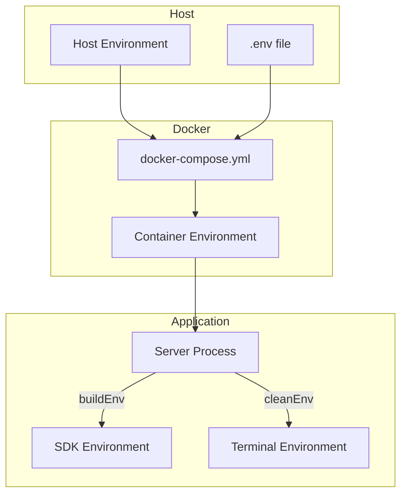

# Environment Variables Specification

## Overview

Environment variable isolation prevents sensitive credentials and internal configuration from leaking to AI agents and subprocesses.

## SDK Environment Allowlist

### Allowed Variables

```typescript
// apps/server/src/providers/claude-provider.ts

const ALLOWED_ENV_VARS = [
  'ANTHROPIC_API_KEY',
  'ANTHROPIC_BASE_URL',
  'ANTHROPIC_AUTH_TOKEN',
  'PATH',
  'HOME',
  'SHELL',
  'TERM',
  'USER',
  'LANG',
  'LC_ALL',
];
```

### Variable Categories

| Category | Variables | Purpose |
|----------|-----------|---------|
| **API Auth** | `ANTHROPIC_API_KEY`, `ANTHROPIC_AUTH_TOKEN` | Claude API authentication |
| **API Config** | `ANTHROPIC_BASE_URL` | Custom API endpoint |
| **System** | `PATH`, `HOME`, `SHELL`, `USER` | Basic shell operation |
| **Terminal** | `TERM` | Terminal type for PTY |
| **Locale** | `LANG`, `LC_ALL` | Character encoding |

### Build Environment Function

```typescript
function buildEnv(): Record<string, string | undefined> {
  const env: Record<string, string | undefined> = {};
  for (const key of ALLOWED_ENV_VARS) {
    if (process.env[key]) {
      env[key] = process.env[key];
    }
  }
  return env;
}
```

## Terminal Environment Sanitization

### Excluded Variables

```typescript
// apps/server/src/services/terminal-service.ts

const automakerEnvVars = [
  'PORT',
  'DATA_DIR',
  'AUTOMAKER_API_KEY',
  'NODE_PATH',
];
```

| Variable | Reason Excluded |
|----------|-----------------|
| `PORT` | Would conflict with user's dev servers |
| `DATA_DIR` | Internal server configuration |
| `AUTOMAKER_API_KEY` | Internal authentication secret |
| `NODE_PATH` | Could affect Node.js resolution |

### Clean Environment Construction

```typescript
const cleanEnv: Record<string, string> = {};
for (const [key, value] of Object.entries(process.env)) {
  if (value !== undefined && !automakerEnvVars.includes(key)) {
    cleanEnv[key] = value;
  }
}

const env: Record<string, string> = {
  ...cleanEnv,
  TERM: 'xterm-256color',
  COLORTERM: 'truecolor',
  TERM_PROGRAM: 'automaker-terminal',
  LANG: process.env.LANG || 'en_US.UTF-8',
  LC_ALL: process.env.LC_ALL || process.env.LANG || 'en_US.UTF-8',
};
```

## Container Environment

### Docker Compose Environment

```yaml
# docker-compose.yml
services:
  server:
    environment:
      # API Authentication
      - ANTHROPIC_API_KEY=${ANTHROPIC_API_KEY}

      # CLI Authentication
      - CLAUDE_OAUTH_CREDENTIALS=${CLAUDE_OAUTH_CREDENTIALS:-}
      - CURSOR_AUTH_TOKEN=${CURSOR_AUTH_TOKEN:-}

      # Server Configuration
      - AUTOMAKER_API_KEY=${AUTOMAKER_API_KEY:-}
      - ALLOWED_ROOT_DIRECTORY=${ALLOWED_ROOT_DIRECTORY:-/projects}
      - DATA_DIR=/data
      - CORS_ORIGIN=${CORS_ORIGIN:-http://localhost:3007}

      # Runtime Indicator
      - IS_CONTAINERIZED=true
```

### Environment Flow



## Configuration Variables

### Server Configuration

| Variable | Purpose | Default |
|----------|---------|---------|
| `PORT` | Server listen port | `3008` |
| `HOST` | Server bind address | `0.0.0.0` |
| `DATA_DIR` | Data storage path | `./data` |
| `ALLOWED_ROOT_DIRECTORY` | Security boundary | None |

### Feature Flags

| Variable | Purpose | Default |
|----------|---------|---------|
| `AUTOMAKER_MOCK_AGENT` | Enable mock agent | `false` |
| `IS_CONTAINERIZED` | Sandbox mode flag | `false` |

### Terminal Configuration

| Variable | Purpose | Default |
|----------|---------|---------|
| `TERMINAL_MAX_SESSIONS` | Max concurrent terminals | `1000` |

## Security Considerations

### Sensitive Variables NOT Passed

| Variable Pattern | Risk |
|------------------|------|
| `DATABASE_URL` | Database access |
| `AWS_*` | Cloud provider credentials |
| `GH_*` | GitHub tokens |
| `SECRET_*` | Generic secrets |
| `PASSWORD*` | Passwords |
| `PRIVATE_KEY*` | Private keys |
| `*_TOKEN` (most) | Various API tokens |

### Attack Vectors Prevented

1. **Credential Theft**: AI cannot access secrets not in allowlist
2. **Environment Injection**: Cannot modify sensitive vars
3. **Cross-Service Access**: Cannot access other service credentials
4. **Port Conflicts**: Internal ports excluded from terminal

## Implementation Details

### SDK Options

```typescript
const sdkOptions: Options = {
  model,
  env: buildEnv(),  // Only allowed variables
  permissionMode: 'bypassPermissions',
  // ...
};
```

### Terminal Spawn

```typescript
const ptyOptions: pty.IPtyForkOptions = {
  name: 'xterm-256color',
  cols: options.cols || 80,
  rows: options.rows || 24,
  cwd,
  env,  // Sanitized environment
};

ptyProcess = pty.spawn(shell, shellArgs, ptyOptions);
```

## Testing

### Verify SDK Environment

```typescript
describe('SDK Environment', () => {
  it('includes allowed variables', () => {
    process.env.ANTHROPIC_API_KEY = 'test-key';
    const env = buildEnv();
    expect(env.ANTHROPIC_API_KEY).toBe('test-key');
  });

  it('excludes sensitive variables', () => {
    process.env.DATABASE_URL = 'postgres://...';
    const env = buildEnv();
    expect(env.DATABASE_URL).toBeUndefined();
  });
});
```

### Verify Terminal Environment

```typescript
describe('Terminal Environment', () => {
  it('excludes automaker variables', () => {
    process.env.PORT = '3008';
    process.env.AUTOMAKER_API_KEY = 'secret';

    const session = await terminalService.createSession({});
    // Verify PORT and AUTOMAKER_API_KEY not in session.env
  });
});
```

## Best Practices

### Adding New Variables

1. Only add variables that are truly necessary
2. Prefer specific variables over wildcards
3. Document why each variable is needed
4. Consider security implications

### Debugging

```typescript
// Log allowed environment (safe)
console.log('SDK environment:', Object.keys(buildEnv()));

// Never log values
// ❌ console.log('API Key:', process.env.ANTHROPIC_API_KEY);
```

## Related Documents

- [Path Boundary](./path-boundary.md) - Path restrictions
- [Secure FS](./secure-fs.md) - File system adapter
- [Provider](../sdk-integration/provider.md) - SDK integration
- [Terminal Service](../terminal/terminal-service.md) - Terminal management
