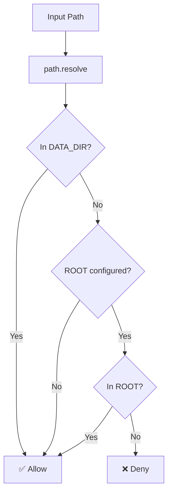

# Path Boundary Specification

## Overview

The path boundary enforcement system restricts all file operations to designated directories, preventing unauthorized access to the host filesystem.

## Configuration

### Environment Variables

| Variable | Purpose | Default |
|----------|---------|---------|
| `ALLOWED_ROOT_DIRECTORY` | Primary security boundary | None (all paths allowed) |
| `DATA_DIR` | Exception for settings/credentials | None |

### Initialization

```typescript
// libs/platform/src/security.ts

let allowedRootDirectory: string | null = null;
let dataDirectory: string | null = null;

export function initAllowedPaths(): void {
  const rootDir = process.env.ALLOWED_ROOT_DIRECTORY;
  if (rootDir) {
    allowedRootDirectory = path.resolve(rootDir);
    console.log(`[Security] ✓ ALLOWED_ROOT_DIRECTORY configured: ${allowedRootDirectory}`);
  } else {
    console.log('[Security] ⚠️  ALLOWED_ROOT_DIRECTORY not set - allowing access to all paths');
  }

  const dataDir = process.env.DATA_DIR;
  if (dataDir) {
    dataDirectory = path.resolve(dataDir);
    console.log(`[Security] ✓ DATA_DIR configured: ${dataDirectory}`);
  }
}
```

## Path Validation

### Core Algorithm

```typescript
export function isPathAllowed(filePath: string): boolean {
  const resolvedPath = path.resolve(filePath);

  // Always allow DATA_DIR (settings, credentials)
  if (dataDirectory && isPathWithinDirectory(resolvedPath, dataDirectory)) {
    return true;
  }

  // If no restriction configured, allow all
  if (!allowedRootDirectory) {
    return true;
  }

  // Check against ALLOWED_ROOT_DIRECTORY
  return isPathWithinDirectory(resolvedPath, allowedRootDirectory);
}
```

### Traversal Protection

```typescript
export function isPathWithinDirectory(
  resolvedPath: string,
  directoryPath: string
): boolean {
  const relativePath = path.relative(directoryPath, resolvedPath);

  // Blocked if:
  // - Relative path starts with ".." (traversal)
  // - Relative path is absolute (different root)
  return !relativePath.startsWith('..') && !path.isAbsolute(relativePath);
}
```

### Example Validations

```typescript
// Configuration:
// ALLOWED_ROOT_DIRECTORY=/projects
// DATA_DIR=/data

// ✅ Allowed paths
isPathAllowed('/projects/my-app/src/index.ts')     // true - in root
isPathAllowed('/projects/nested/deep/file.txt')   // true - in root
isPathAllowed('/data/settings.json')              // true - DATA_DIR exception
isPathAllowed('/data/agent-sessions/123.json')    // true - DATA_DIR exception

// ❌ Blocked paths
isPathAllowed('/etc/passwd')                       // false - outside root
isPathAllowed('/home/user/.ssh/id_rsa')           // false - outside root
isPathAllowed('/projects/../etc/passwd')           // false - traversal
isPathAllowed('/projects/../../root/.bashrc')      // false - traversal
```

## Path Validation Function

```typescript
export function validatePath(filePath: string): string {
  const resolvedPath = path.resolve(filePath);

  if (!isPathAllowed(resolvedPath)) {
    throw new PathNotAllowedError(filePath);
  }

  return resolvedPath;
}
```

### Error Class

```typescript
export class PathNotAllowedError extends Error {
  constructor(filePath: string) {
    super(
      `Path not allowed: ${filePath}. ` +
      `Must be within ALLOWED_ROOT_DIRECTORY or DATA_DIR.`
    );
    this.name = 'PathNotAllowedError';
  }
}
```

## Decision Flow



## Security Properties

### Path Normalization

All paths are resolved before validation:

```typescript
const resolvedPath = path.resolve(filePath);
// Handles:
// - Relative paths: ./file.txt → /cwd/file.txt
// - Parent references: ../sibling/file → resolved absolute
// - Double slashes: //path//file → /path/file
// - Trailing slashes: /path/to/dir/ → /path/to/dir
```

### Symlink Handling

Symlinks are resolved to their real paths:

```typescript
// If /projects/link → /etc
// Accessing /projects/link/passwd
// resolves to /etc/passwd
// which is OUTSIDE /projects
// and will be BLOCKED
```

### Null Byte Protection

Paths with null bytes are rejected at validation:

```typescript
// Attack: /projects/file\x00.txt
// After resolution, null bytes are preserved
// Path validation will reject as outside allowed paths
```

## Accessor Functions

```typescript
// Get configured boundaries
export function getAllowedRootDirectory(): string | null {
  return allowedRootDirectory;
}

export function getDataDirectory(): string | null {
  return dataDirectory;
}

// Get all allowed paths (for debugging)
export function getAllowedPaths(): string[] {
  const paths: string[] = [];
  if (allowedRootDirectory) {
    paths.push(allowedRootDirectory);
  }
  if (dataDirectory) {
    paths.push(dataDirectory);
  }
  return paths;
}
```

## Usage Examples

### In Secure FS

```typescript
// libs/platform/src/secure-fs.ts

import { validatePath } from './security.js';

export async function readFile(
  filePath: string,
  encoding?: BufferEncoding
): Promise<string | Buffer> {
  const validatedPath = validatePath(filePath);  // Throws if not allowed
  return fs.readFile(validatedPath, encoding);
}
```

### In Terminal Service

```typescript
// apps/server/src/services/terminal-service.ts

import * as secureFs from '../lib/secure-fs.js';

private async resolveWorkingDirectory(requestedCwd?: string): Promise<string> {
  const homeDir = os.homedir();

  if (!requestedCwd) {
    return homeDir;
  }

  try {
    const statResult = await secureFs.stat(cwd);  // Uses validatePath
    if (statResult.isDirectory()) {
      return cwd;
    }
  } catch {
    // Path not allowed or doesn't exist
    return homeDir;
  }

  return homeDir;
}
```

## Testing

### Unit Tests

```typescript
describe('isPathWithinDirectory', () => {
  it('allows paths within directory', () => {
    expect(isPathWithinDirectory('/projects/app/src', '/projects')).toBe(true);
    expect(isPathWithinDirectory('/projects/file.txt', '/projects')).toBe(true);
  });

  it('blocks paths outside directory', () => {
    expect(isPathWithinDirectory('/etc/passwd', '/projects')).toBe(false);
    expect(isPathWithinDirectory('/home/user', '/projects')).toBe(false);
  });

  it('blocks traversal attempts', () => {
    expect(isPathWithinDirectory('/projects/../etc', '/projects')).toBe(false);
    expect(isPathWithinDirectory('/projects/../../root', '/projects')).toBe(false);
  });

  it('allows directory itself', () => {
    expect(isPathWithinDirectory('/projects', '/projects')).toBe(true);
  });
});
```

### Integration Tests

```typescript
describe('Path validation integration', () => {
  beforeAll(() => {
    process.env.ALLOWED_ROOT_DIRECTORY = '/projects';
    process.env.DATA_DIR = '/data';
    initAllowedPaths();
  });

  it('blocks read outside boundaries', async () => {
    await expect(secureFs.readFile('/etc/passwd')).rejects.toThrow(
      PathNotAllowedError
    );
  });

  it('allows read within boundaries', async () => {
    await expect(
      secureFs.readFile('/projects/file.txt')
    ).resolves.toBeDefined();
  });
});
```

## Related Documents

- [Secure FS](./secure-fs.md) - File system adapter
- [Isolation Layers](../architecture/isolation-layers.md) - Security model
- [Environment Variables](./environment-variables.md) - Env configuration
