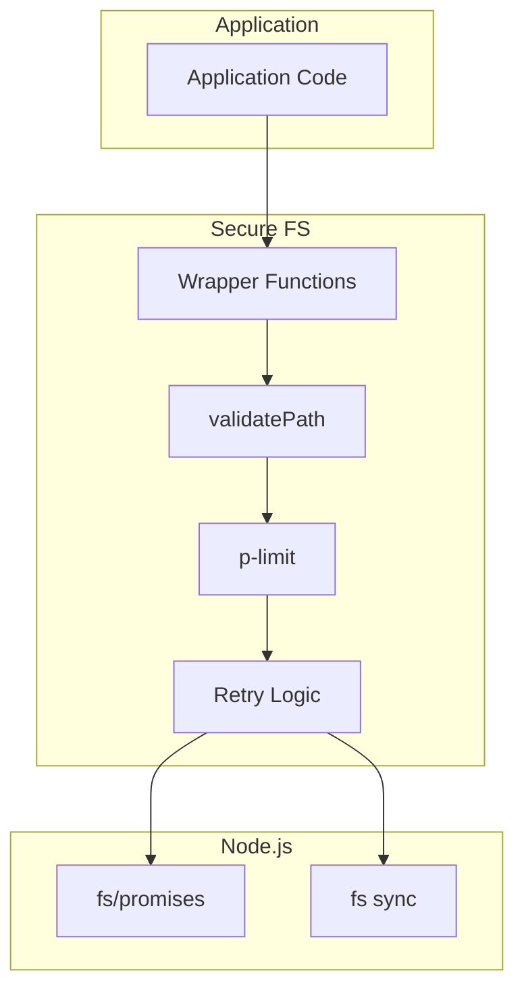

# Secure File System Specification

## Overview

The secure file system adapter (`secure-fs.ts`) provides a drop-in replacement for Node.js `fs` operations with integrated path validation, concurrency control, and retry logic.

## Architecture



## Throttle Configuration

```typescript
interface ThrottleConfig {
  /** Maximum concurrent file operations (default: 100) */
  maxConcurrency: number;
  /** Maximum retry attempts for ENFILE/EMFILE errors (default: 3) */
  maxRetries: number;
  /** Base delay in ms for exponential backoff (default: 100) */
  baseDelay: number;
  /** Maximum delay in ms for exponential backoff (default: 5000) */
  maxDelay: number;
}

const DEFAULT_CONFIG: ThrottleConfig = {
  maxConcurrency: 100,
  maxRetries: 3,
  baseDelay: 100,
  maxDelay: 5000,
};
```

### Configuration API

```typescript
// Configure throttling settings
export function configureThrottling(newConfig: Partial<ThrottleConfig>): void;

// Get current configuration
export function getThrottlingConfig(): Readonly<ThrottleConfig>;

// Get queue status
export function getPendingOperations(): number;
export function getActiveOperations(): number;
```

## Async Operations

### readFile

```typescript
export async function readFile(
  filePath: string,
  encoding?: BufferEncoding
): Promise<string | Buffer> {
  const validatedPath = validatePath(filePath);
  return executeWithRetry(() => {
    if (encoding) {
      return fs.readFile(validatedPath, encoding);
    }
    return fs.readFile(validatedPath);
  }, `readFile(${filePath})`);
}
```

### writeFile

```typescript
export interface WriteFileOptions {
  encoding?: BufferEncoding;
  mode?: number;
  flag?: string;
}

export async function writeFile(
  filePath: string,
  data: string | Buffer,
  optionsOrEncoding?: BufferEncoding | WriteFileOptions
): Promise<void> {
  const validatedPath = validatePath(filePath);
  return executeWithRetry(
    () => fs.writeFile(validatedPath, data, optionsOrEncoding),
    `writeFile(${filePath})`
  );
}
```

### mkdir

```typescript
export async function mkdir(
  dirPath: string,
  options?: { recursive?: boolean; mode?: number }
): Promise<string | undefined> {
  const validatedPath = validatePath(dirPath);
  return executeWithRetry(
    () => fs.mkdir(validatedPath, options),
    `mkdir(${dirPath})`
  );
}
```

### readdir

```typescript
export async function readdir(
  dirPath: string,
  options?: { withFileTypes?: false; encoding?: BufferEncoding }
): Promise<string[]>;

export async function readdir(
  dirPath: string,
  options: { withFileTypes: true; encoding?: BufferEncoding }
): Promise<Dirent[]>;

export async function readdir(
  dirPath: string,
  options?: { withFileTypes?: boolean; encoding?: BufferEncoding }
): Promise<string[] | Dirent[]> {
  const validatedPath = validatePath(dirPath);
  return executeWithRetry(() => {
    if (options?.withFileTypes === true) {
      return fs.readdir(validatedPath, { withFileTypes: true });
    }
    return fs.readdir(validatedPath);
  }, `readdir(${dirPath})`);
}
```

### stat / lstat

```typescript
export async function stat(
  filePath: string
): Promise<ReturnType<typeof fs.stat>> {
  const validatedPath = validatePath(filePath);
  return executeWithRetry(
    () => fs.stat(validatedPath),
    `stat(${filePath})`
  );
}

export async function lstat(
  filePath: string
): Promise<ReturnType<typeof fs.lstat>> {
  const validatedPath = validatePath(filePath);
  return executeWithRetry(
    () => fs.lstat(validatedPath),
    `lstat(${filePath})`
  );
}
```

### rm / unlink

```typescript
export async function rm(
  filePath: string,
  options?: { recursive?: boolean; force?: boolean }
): Promise<void> {
  const validatedPath = validatePath(filePath);
  return executeWithRetry(
    () => fs.rm(validatedPath, options),
    `rm(${filePath})`
  );
}

export async function unlink(filePath: string): Promise<void> {
  const validatedPath = validatePath(filePath);
  return executeWithRetry(
    () => fs.unlink(validatedPath),
    `unlink(${filePath})`
  );
}
```

### copyFile / rename

```typescript
export async function copyFile(
  src: string,
  dest: string,
  mode?: number
): Promise<void> {
  const validatedSrc = validatePath(src);
  const validatedDest = validatePath(dest);
  return executeWithRetry(
    () => fs.copyFile(validatedSrc, validatedDest, mode),
    `copyFile(${src}, ${dest})`
  );
}

export async function rename(
  oldPath: string,
  newPath: string
): Promise<void> {
  const validatedOldPath = validatePath(oldPath);
  const validatedNewPath = validatePath(newPath);
  return executeWithRetry(
    () => fs.rename(validatedOldPath, validatedNewPath),
    `rename(${oldPath}, ${newPath})`
  );
}
```

## Sync Operations

```typescript
export function existsSync(filePath: string): boolean {
  const validatedPath = validatePath(filePath);
  return fsSync.existsSync(validatedPath);
}

export function readFileSync(
  filePath: string,
  encoding?: BufferEncoding
): string | Buffer {
  const validatedPath = validatePath(filePath);
  return encoding
    ? fsSync.readFileSync(validatedPath, encoding)
    : fsSync.readFileSync(validatedPath);
}

export function writeFileSync(
  filePath: string,
  data: string | Buffer,
  options?: WriteFileSyncOptions
): void {
  const validatedPath = validatePath(filePath);
  fsSync.writeFileSync(validatedPath, data, options);
}

export function mkdirSync(
  dirPath: string,
  options?: { recursive?: boolean; mode?: number }
): string | undefined {
  const validatedPath = validatePath(dirPath);
  return fsSync.mkdirSync(validatedPath, options);
}

export function readdirSync(
  dirPath: string,
  options?: { withFileTypes?: boolean }
): string[] | Dirent[] {
  const validatedPath = validatePath(dirPath);
  if (options?.withFileTypes === true) {
    return fsSync.readdirSync(validatedPath, { withFileTypes: true });
  }
  return fsSync.readdirSync(validatedPath);
}

export function statSync(filePath: string): Stats {
  const validatedPath = validatePath(filePath);
  return fsSync.statSync(validatedPath);
}

export function accessSync(filePath: string, mode?: number): void {
  const validatedPath = validatePath(filePath);
  fsSync.accessSync(validatedPath, mode);
}

export function unlinkSync(filePath: string): void {
  const validatedPath = validatePath(filePath);
  fsSync.unlinkSync(validatedPath);
}

export function rmSync(
  filePath: string,
  options?: { recursive?: boolean; force?: boolean }
): void {
  const validatedPath = validatePath(filePath);
  fsSync.rmSync(validatedPath, options);
}
```

## Retry Logic

### File Descriptor Errors

```typescript
const FILE_DESCRIPTOR_ERROR_CODES = new Set(['ENFILE', 'EMFILE']);

function isFileDescriptorError(error: unknown): boolean {
  if (error && typeof error === 'object' && 'code' in error) {
    return FILE_DESCRIPTOR_ERROR_CODES.has((error as { code: string }).code);
  }
  return false;
}
```

### Exponential Backoff

```typescript
function calculateDelay(attempt: number): number {
  const exponentialDelay = config.baseDelay * Math.pow(2, attempt);
  const jitter = Math.random() * config.baseDelay;
  return Math.min(exponentialDelay + jitter, config.maxDelay);
}
```

### Execution with Retry

```typescript
async function executeWithRetry<T>(
  operation: () => Promise<T>,
  operationName: string
): Promise<T> {
  return fsLimit(async () => {
    let lastError: unknown;

    for (let attempt = 0; attempt <= config.maxRetries; attempt++) {
      try {
        return await operation();
      } catch (error) {
        lastError = error;

        if (isFileDescriptorError(error) && attempt < config.maxRetries) {
          const delay = calculateDelay(attempt);
          console.warn(
            `[SecureFS] ${operationName}: File descriptor error ` +
            `(attempt ${attempt + 1}/${config.maxRetries + 1}), ` +
            `retrying in ${delay}ms`
          );
          await sleep(delay);
          continue;
        }

        throw error;
      }
    }

    throw lastError;
  });
}
```

## Environment File Operations

### readEnvFile

```typescript
export async function readEnvFile(
  envPath: string
): Promise<Record<string, string>> {
  const validatedPath = validatePath(envPath);
  try {
    const content = await executeWithRetry(
      () => fs.readFile(validatedPath, 'utf-8'),
      `readEnvFile(${envPath})`
    );
    return parseEnvContent(content);
  } catch (error) {
    if ((error as NodeJS.ErrnoException).code === 'ENOENT') {
      return {};
    }
    throw error;
  }
}
```

### writeEnvKey

```typescript
export async function writeEnvKey(
  envPath: string,
  key: string,
  value: string
): Promise<void> {
  const validatedPath = validatePath(envPath);

  let content = '';
  try {
    content = await executeWithRetry(
      () => fs.readFile(validatedPath, 'utf-8'),
      `readFile(${envPath})`
    );
  } catch (error) {
    if ((error as NodeJS.ErrnoException).code !== 'ENOENT') {
      throw error;
    }
  }

  const newContent = updateEnvContent(content, key, value);
  await executeWithRetry(
    () => fs.writeFile(validatedPath, newContent),
    `writeFile(${envPath})`
  );
}
```

### removeEnvKey

```typescript
export async function removeEnvKey(
  envPath: string,
  key: string
): Promise<void> {
  const validatedPath = validatePath(envPath);

  let content = '';
  try {
    content = await executeWithRetry(
      () => fs.readFile(validatedPath, 'utf-8'),
      `readFile(${envPath})`
    );
  } catch (error) {
    if ((error as NodeJS.ErrnoException).code === 'ENOENT') {
      return;
    }
    throw error;
  }

  const newContent = removeEnvKeyFromContent(content, key);
  await executeWithRetry(
    () => fs.writeFile(validatedPath, newContent),
    `writeFile(${envPath})`
  );
}
```

## Path Utilities

```typescript
// Path construction (no validation)
export function joinPath(...pathSegments: string[]): string {
  return path.join(...pathSegments);
}

export function resolvePath(...pathSegments: string[]): string {
  return path.resolve(...pathSegments);
}
```

## Usage Example

```typescript
import * as secureFs from './secure-fs.js';

// Initialize security
initAllowedPaths();

// Read file (validated and throttled)
const content = await secureFs.readFile('/projects/app/config.json', 'utf-8');

// Write file (validated and throttled)
await secureFs.writeFile('/projects/app/output.txt', 'Hello, World!');

// Create directory (validated)
await secureFs.mkdir('/projects/app/logs', { recursive: true });

// List directory (validated)
const files = await secureFs.readdir('/projects/app/src');

// Sync operations also validated
if (secureFs.existsSync('/projects/app/package.json')) {
  const pkg = secureFs.readFileSync('/projects/app/package.json', 'utf-8');
}
```

## Related Documents

- [Path Boundary](./path-boundary.md) - Path validation
- [Environment Variables](./environment-variables.md) - Env configuration
- [Tool Execution](../sdk-integration/tool-execution.md) - Tool integration
