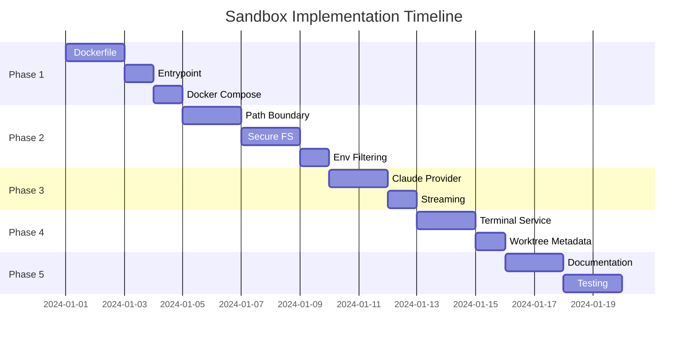

# Implementation Tasks

This document provides a phased implementation breakdown for building the Docker-based sandbox from scratch.

## Phase 1: Container Foundation

### Task 1.1: Multi-Stage Dockerfile

**Objective**: Create the Dockerfile with multi-stage builds for optimized images.

**Files to Create/Modify**:
- `Dockerfile`

**Implementation Steps**:

1. Create base stage with Node.js 22-slim and build dependencies
   ```dockerfile
   FROM node:22-slim AS base
   RUN apt-get update && apt-get install -y python3 make g++
   ```

2. Create server-builder stage for compilation
   - Copy package.json files for all workspaces
   - Run `npm ci --ignore-scripts && npm rebuild node-pty`
   - Build packages and server

3. Create server production stage
   - Install runtime dependencies (git, curl, bash, gosu)
   - Install Playwright/Chromium dependencies
   - Install GitHub CLI (pinned version, multi-arch)
   - Install Claude CLI globally
   - Create non-root user with configurable UID/GID
   - Configure git safe directories and credential helper

4. Create UI production stage with nginx

**Acceptance Criteria**:
- [ ] `docker build --target server` succeeds
- [ ] `docker build --target ui` succeeds
- [ ] Container runs as non-root user
- [ ] All CLI tools (gh, claude) are available

---

### Task 1.2: Docker Entrypoint Script

**Objective**: Create entrypoint script for permission handling and credential injection.

**Files to Create/Modify**:
- `docker-entrypoint.sh`

**Implementation Steps**:

1. Create shell script with `#!/bin/sh` and `set -e`
2. Create Claude CLI config directory with 700 permissions
3. Inject CLAUDE_OAUTH_CREDENTIALS if set
4. Create Cursor CLI config directory
5. Inject CURSOR_AUTH_TOKEN if set
6. Create OpenCode directories (data, config, cache)
7. Create npm cache directory
8. Switch to automaker user with `exec gosu automaker "$@"`

**Acceptance Criteria**:
- [ ] Script creates all required directories
- [ ] Credentials are injected with 600 permissions
- [ ] Container runs as automaker user
- [ ] Health check passes

---

### Task 1.3: Docker Compose Configuration

**Objective**: Configure Docker Compose for multi-service orchestration.

**Files to Create/Modify**:
- `docker-compose.yml`

**Implementation Steps**:

1. Define UI service (nginx, port 3007)
2. Define server service (Node.js, port 3008)
3. Configure named volumes (data, claude-config, cursor-config, opencode-*)
4. Set up environment variable passthrough
5. Configure build args for UID/GID
6. Set IS_CONTAINERIZED=true

**Acceptance Criteria**:
- [ ] `docker-compose up` starts both services
- [ ] UI is accessible at localhost:3007
- [ ] API is accessible at localhost:3008
- [ ] Volumes persist across restarts

---

## Phase 2: Security Layer

### Task 2.1: Path Boundary Module

**Objective**: Implement ALLOWED_ROOT_DIRECTORY enforcement.

**Files to Create/Modify**:
- `libs/platform/src/security.ts`

**Implementation Steps**:

1. Create `PathNotAllowedError` class
2. Implement `initAllowedPaths()` to load from env
3. Implement `isPathWithinDirectory()` for traversal protection
4. Implement `isPathAllowed()` with DATA_DIR exception
5. Implement `validatePath()` that throws on violation
6. Add accessor functions for configured paths

**Acceptance Criteria**:
- [ ] Paths within ALLOWED_ROOT_DIRECTORY are allowed
- [ ] Paths within DATA_DIR are allowed (exception)
- [ ] Paths outside both are rejected
- [ ] Traversal attempts (../) are blocked
- [ ] Unit tests pass

---

### Task 2.2: Secure File System Adapter

**Objective**: Wrap all fs operations with path validation and throttling.

**Files to Create/Modify**:
- `libs/platform/src/secure-fs.ts`

**Implementation Steps**:

1. Configure p-limit for concurrency control (100 concurrent ops)
2. Implement `executeWithRetry()` with exponential backoff
3. Wrap async fs operations: readFile, writeFile, mkdir, readdir, stat, rm, etc.
4. Wrap sync fs operations: existsSync, readFileSync, writeFileSync, etc.
5. Implement env file operations: readEnvFile, writeEnvKey, removeEnvKey
6. Add path utilities: joinPath, resolvePath

**Acceptance Criteria**:
- [ ] All operations validate paths before execution
- [ ] ENFILE/EMFILE errors trigger retries
- [ ] Concurrency is limited to configured max
- [ ] Unit tests pass

---

### Task 2.3: Environment Variable Filtering

**Objective**: Filter environment variables passed to SDK and terminals.

**Files to Create/Modify**:
- `apps/server/src/providers/claude-provider.ts`
- `apps/server/src/services/terminal-service.ts`

**Implementation Steps**:

1. Define ALLOWED_ENV_VARS constant in claude-provider.ts
2. Implement `buildEnv()` function for SDK
3. Define excluded vars for terminal service
4. Implement clean environment construction for terminals

**Acceptance Criteria**:
- [ ] Only allowlisted vars reach SDK
- [ ] Terminal sessions exclude internal vars
- [ ] No credential leakage in subprocesses

---

## Phase 3: SDK Integration

### Task 3.1: Claude Provider

**Objective**: Implement ClaudeProvider wrapping the Claude Agent SDK.

**Files to Create/Modify**:
- `apps/server/src/providers/claude-provider.ts`
- `apps/server/src/providers/base-provider.ts`

**Implementation Steps**:

1. Create BaseProvider abstract class
2. Implement ClaudeProvider extending BaseProvider
3. Implement `executeQuery()` as AsyncGenerator
4. Configure autonomous mode (bypassPermissions)
5. Handle multi-part prompts (images)
6. Implement session resume via sdkSessionId
7. Add error classification and enhancement
8. Implement `detectInstallation()` and `getAvailableModels()`

**Acceptance Criteria**:
- [ ] Provider yields streaming events correctly
- [ ] Session resume works with sdkSessionId
- [ ] Errors are classified and enhanced
- [ ] Rate limit errors include retry guidance

---

### Task 3.2: Streaming Infrastructure

**Objective**: Set up event streaming from SDK to frontend.

**Files to Create/Modify**:
- `apps/server/src/services/agent-service.ts`
- `apps/server/src/lib/events.ts`

**Implementation Steps**:

1. Create event emitter for agent events
2. Process AsyncGenerator messages by type
3. Broadcast events via WebSocket
4. Handle stream_event, tool_use, tool_result, result
5. Implement cancellation via AbortController

**Acceptance Criteria**:
- [ ] Tokens stream to frontend in real-time
- [ ] Tool events are broadcast correctly
- [ ] Cancellation stops the stream
- [ ] Memory doesn't grow unbounded

---

## Phase 4: Terminal & Worktree

### Task 4.1: Terminal Service

**Objective**: Implement PTY session management.

**Files to Create/Modify**:
- `apps/server/src/services/terminal-service.ts`

**Implementation Steps**:

1. Implement TerminalService class with EventEmitter
2. Add shell detection for multiple platforms
3. Implement working directory validation via secureFs
4. Add environment sanitization
5. Implement output throttling and scrollback buffer
6. Add session limits (TERMINAL_MAX_SESSIONS)
7. Handle Windows ConPTY/winpty fallback
8. Implement graceful shutdown (SIGTERM → SIGKILL)

**Acceptance Criteria**:
- [ ] Terminals work on Linux, macOS, Windows
- [ ] Working directory is validated
- [ ] Environment is sanitized
- [ ] Session limits are enforced
- [ ] Output is throttled correctly

---

### Task 4.2: Worktree Metadata

**Objective**: Implement worktree metadata storage.

**Files to Create/Modify**:
- `apps/server/src/lib/worktree-metadata.ts`

**Implementation Steps**:

1. Define WorktreeMetadata and WorktreePRInfo interfaces
2. Implement `sanitizeBranchName()` for cross-platform safety
3. Implement CRUD operations for metadata
4. Store metadata in `.automaker/worktrees/{branch}/worktree.json`
5. Track init script status

**Acceptance Criteria**:
- [ ] Branch names are safely sanitized
- [ ] Metadata persists correctly
- [ ] PR info can be updated
- [ ] Cleanup removes metadata

---

## Phase 5: Documentation & Testing

### Task 5.1: Specification Documentation

**Objective**: Create comprehensive spec documentation.

**Files to Create**:
- `specs/sandbox/README.md`
- `specs/sandbox/architecture/*.md`
- `specs/sandbox/container/*.md`
- `specs/sandbox/sdk-integration/*.md`
- `specs/sandbox/security/*.md`
- `specs/sandbox/terminal/*.md`
- `specs/sandbox/worktree/*.md`

**Implementation Steps**:

1. Create README with overview and document tree
2. Write architecture diagrams (mermaid)
3. Document each component with:
   - Purpose and overview
   - Code examples
   - Configuration options
   - Security considerations

**Acceptance Criteria**:
- [ ] All spec files created
- [ ] Diagrams render correctly
- [ ] Examples are accurate

---

### Task 5.2: Integration Testing

**Objective**: Verify sandbox works end-to-end.

**Test Cases**:

1. **Container Build Test**
   ```bash
   docker build --target server -t sandbox-test .
   docker run --rm sandbox-test whoami  # Should output: automaker
   ```

2. **Path Restriction Test**
   ```bash
   docker run -e ALLOWED_ROOT_DIRECTORY=/projects sandbox-test \
     node -e "require('./libs/platform/dist/secure-fs.js').readFile('/etc/passwd')"
   # Should fail with PathNotAllowedError
   ```

3. **SDK Integration Test**
   - Send message via POST /api/agent/send
   - Verify streaming events via WebSocket
   - Confirm tool execution works

4. **Terminal Test**
   - Create session
   - Verify working directory validation
   - Confirm environment is sanitized

5. **Worktree Test**
   - Create worktree for branch
   - Execute task in isolated directory
   - Merge and cleanup

**Acceptance Criteria**:
- [ ] All test cases pass
- [ ] No security violations possible
- [ ] Clean shutdown works

---

## Implementation Order



## Dependencies

| Phase | Depends On |
|-------|------------|
| Phase 2 | Phase 1 (container must exist) |
| Phase 3 | Phase 2 (security layer must exist) |
| Phase 4 | Phase 2 (secure-fs must exist) |
| Phase 5 | Phases 1-4 (all components must exist) |

## Risk Mitigation

| Risk | Mitigation |
|------|------------|
| node-pty build fails | Include build tools in base stage |
| ConPTY issues on Windows | Fallback to winpty |
| File descriptor exhaustion | p-limit + retry logic |
| Path traversal attacks | Strict validation in security.ts |
| Credential leakage | Explicit allowlist, never wildcard |
