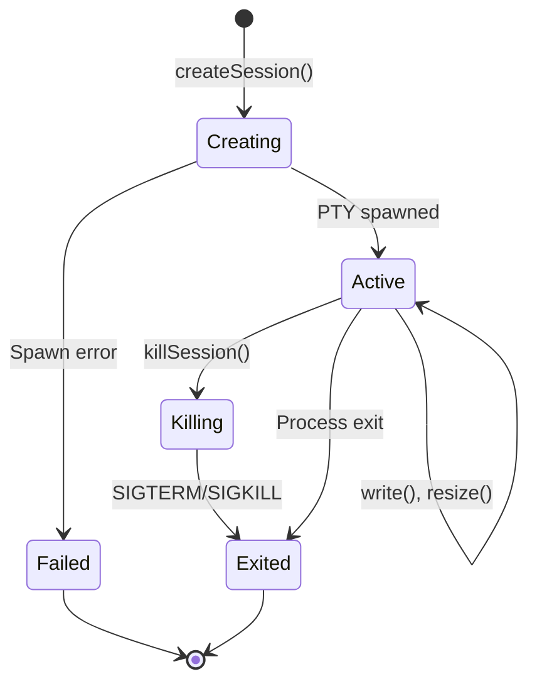

# Terminal Service Specification

## Overview

The Terminal Service manages PTY (pseudo-terminal) sessions using node-pty, providing secure shell access within the sandbox's security boundaries.

## Architecture

```mermaid
graph TB
    subgraph "Client"
        UI[Frontend]
        WS[WebSocket]
    end

    subgraph "Terminal Service"
        Service[TerminalService]
        Sessions[Session Map]
        PTY[node-pty]
    end

    subgraph "Security"
        SecureFS[Secure FS]
        EnvFilter[Env Filter]
    end

    subgraph "Shell"
        Shell[bash/zsh/sh]
    end

    UI -->|Connect| WS
    WS -->|Commands| Service
    Service --> Sessions
    Sessions --> PTY
    PTY --> Shell
    Service --> SecureFS
    Service --> EnvFilter
```

## Class Definition

```typescript
export class TerminalService extends EventEmitter {
  private sessions: Map<string, TerminalSession> = new Map();
  private dataCallbacks: Set<DataCallback> = new Set();
  private exitCallbacks: Set<ExitCallback> = new Set();
  private isWindows = os.platform() === 'win32';

  // Session management
  async createSession(options: TerminalOptions): Promise<TerminalSession | null>;
  write(sessionId: string, data: string): boolean;
  resize(sessionId: string, cols: number, rows: number, suppressOutput?: boolean): boolean;
  killSession(sessionId: string): boolean;

  // Session queries
  getSession(sessionId: string): TerminalSession | undefined;
  getAllSessions(): SessionInfo[];
  getSessionCount(): number;
  getScrollback(sessionId: string): string | null;

  // Configuration
  getMaxSessions(): number;
  setMaxSessions(limit: number): void;

  // Event subscriptions
  onData(callback: DataCallback): () => void;
  onExit(callback: ExitCallback): () => void;

  // Platform detection
  detectShell(): { shell: string; args: string[] };
  isWSL(): boolean;
  getPlatformInfo(): PlatformInfo;

  // Cleanup
  cleanup(): void;
}
```

## Session Interface

```typescript
export interface TerminalSession {
  id: string;
  pty: pty.IPty;
  cwd: string;
  createdAt: Date;
  shell: string;
  scrollbackBuffer: string;
  outputBuffer: string;
  flushTimeout: NodeJS.Timeout | null;
  resizeInProgress: boolean;
  resizeDebounceTimeout: NodeJS.Timeout | null;
}

export interface TerminalOptions {
  cwd?: string;
  shell?: string;
  cols?: number;
  rows?: number;
  env?: Record<string, string>;
}
```

## Session Lifecycle



## Shell Detection

### Platform-Specific Shells

```typescript
detectShell(): { shell: string; args: string[] } {
  const platform = os.platform();
  const shellPaths = getShellPaths();

  // Try user's preferred shell first
  const userShell = process.env.SHELL;
  if (userShell && platform !== 'win32') {
    for (const allowedShell of shellPaths) {
      if (allowedShell === userShell || getBasename(allowedShell) === getBasename(userShell)) {
        if (systemPathExists(allowedShell)) {
          return { shell: allowedShell, args: getShellArgs(allowedShell) };
        }
      }
    }
  }

  // Fall back to first available shell
  for (const shell of shellPaths) {
    if (systemPathExists(shell)) {
      return { shell, args: getShellArgs(shell) };
    }
  }

  // Ultimate fallback
  return platform === 'win32'
    ? { shell: 'cmd.exe', args: [] }
    : { shell: '/bin/sh', args: [] };
}
```

### Shell Arguments

| Shell | Arguments |
|-------|-----------|
| `bash` | `['--login']` |
| `zsh` | `['--login']` |
| `sh` | `[]` |
| `powershell` | `[]` |
| `cmd` | `[]` |

## Working Directory Validation

```typescript
private async resolveWorkingDirectory(requestedCwd?: string): Promise<string> {
  const homeDir = os.homedir();

  if (!requestedCwd) {
    return homeDir;
  }

  let cwd = requestedCwd.trim();

  // Reject paths with null bytes
  if (cwd.includes('\0')) {
    logger.warn(`Rejecting path with null byte`);
    return homeDir;
  }

  // Fix double slashes
  if (cwd.startsWith('//') && !cwd.startsWith('//wsl')) {
    cwd = cwd.slice(1);
  }

  // Normalize path
  if (!cwd.startsWith('//wsl')) {
    cwd = path.resolve(cwd);
  }

  // Validate with secureFs (enforces ALLOWED_ROOT_DIRECTORY)
  try {
    const statResult = await secureFs.stat(cwd);
    if (statResult.isDirectory()) {
      return cwd;
    }
    return homeDir;
  } catch {
    return homeDir;
  }
}
```

## Environment Sanitization

```typescript
// Exclude automaker-specific variables
const automakerEnvVars = ['PORT', 'DATA_DIR', 'AUTOMAKER_API_KEY', 'NODE_PATH'];
const cleanEnv: Record<string, string> = {};

for (const [key, value] of Object.entries(process.env)) {
  if (value !== undefined && !automakerEnvVars.includes(key)) {
    cleanEnv[key] = value;
  }
}

const env: Record<string, string> = {
  ...cleanEnv,
  TERM: 'xterm-256color',
  COLORTERM: 'truecolor',
  TERM_PROGRAM: 'automaker-terminal',
  LANG: process.env.LANG || 'en_US.UTF-8',
  LC_ALL: process.env.LC_ALL || process.env.LANG || 'en_US.UTF-8',
};
```

## Output Throttling

### Configuration

```typescript
const OUTPUT_THROTTLE_MS = 4;    // ~250fps max
const OUTPUT_BATCH_SIZE = 4096;  // Bytes per batch
const MAX_SCROLLBACK_SIZE = 50000; // ~50KB per terminal
```

### Throttled Output

```typescript
const flushOutput = () => {
  if (session.outputBuffer.length === 0) return;

  let dataToSend = session.outputBuffer;
  if (dataToSend.length > OUTPUT_BATCH_SIZE) {
    dataToSend = session.outputBuffer.slice(0, OUTPUT_BATCH_SIZE);
    session.outputBuffer = session.outputBuffer.slice(OUTPUT_BATCH_SIZE);
    session.flushTimeout = setTimeout(flushOutput, OUTPUT_THROTTLE_MS);
  } else {
    session.outputBuffer = '';
    session.flushTimeout = null;
  }

  this.dataCallbacks.forEach((cb) => cb(id, dataToSend));
  this.emit('data', id, dataToSend);
};
```

### Scrollback Buffer

```typescript
ptyProcess.onData((data) => {
  // Skip during resize
  if (session.resizeInProgress) {
    return;
  }

  // Append to scrollback
  session.scrollbackBuffer += data;
  if (session.scrollbackBuffer.length > MAX_SCROLLBACK_SIZE) {
    session.scrollbackBuffer = session.scrollbackBuffer.slice(-MAX_SCROLLBACK_SIZE);
  }

  // Buffer for throttled delivery
  session.outputBuffer += data;

  if (!session.flushTimeout) {
    session.flushTimeout = setTimeout(flushOutput, OUTPUT_THROTTLE_MS);
  }
});
```

## Resize Handling

```typescript
resize(
  sessionId: string,
  cols: number,
  rows: number,
  suppressOutput: boolean = true
): boolean {
  const session = this.sessions.get(sessionId);
  if (!session) return false;

  try {
    if (suppressOutput) {
      session.resizeInProgress = true;
      if (session.resizeDebounceTimeout) {
        clearTimeout(session.resizeDebounceTimeout);
      }
    }

    session.pty.resize(cols, rows);

    if (suppressOutput) {
      // Clear flag after prompt settles (150ms)
      session.resizeDebounceTimeout = setTimeout(() => {
        session.resizeInProgress = false;
        session.resizeDebounceTimeout = null;
      }, 150);
    }

    return true;
  } catch (error) {
    session.resizeInProgress = false;
    return false;
  }
}
```

## Session Termination

```typescript
killSession(sessionId: string): boolean {
  const session = this.sessions.get(sessionId);
  if (!session) return false;

  try {
    // Clean up timeouts
    if (session.flushTimeout) {
      clearTimeout(session.flushTimeout);
    }
    if (session.resizeDebounceTimeout) {
      clearTimeout(session.resizeDebounceTimeout);
    }

    // Graceful shutdown
    this.killPtyProcess(session.pty, 'SIGTERM');

    // Force kill after 1 second
    setTimeout(() => {
      if (this.sessions.has(sessionId)) {
        try {
          this.killPtyProcess(session.pty, 'SIGKILL');
        } catch {}
        this.sessions.delete(sessionId);
      }
    }, 1000);

    return true;
  } catch (error) {
    this.sessions.delete(sessionId);
    return false;
  }
}

private killPtyProcess(ptyProcess: pty.IPty, signal: string = 'SIGTERM'): void {
  if (this.isWindows) {
    ptyProcess.kill();  // Windows doesn't support signals
  } else {
    ptyProcess.kill(signal);
  }
}
```

## Windows ConPTY Handling

```typescript
if (this.isWindows) {
  (ptyOptions as pty.IWindowsPtyForkOptions).useConpty = false;
  logger.info('Using winpty for compatibility');
}
```

### ConPTY Fallback

```typescript
try {
  ptyProcess = pty.spawn(shell, shellArgs, ptyOptions);
} catch (spawnError) {
  if (this.isWindows && errorMessage.includes('AttachConsole failed')) {
    // Retry with winpty
    (ptyOptions as pty.IWindowsPtyForkOptions).useConpty = false;
    ptyProcess = pty.spawn(shell, shellArgs, ptyOptions);
  } else {
    return null;
  }
}
```

## Event Handling

### Data Events

```typescript
onData(callback: DataCallback): () => void {
  this.dataCallbacks.add(callback);
  return () => this.dataCallbacks.delete(callback);
}

// Usage
const unsubscribe = terminalService.onData((sessionId, data) => {
  ws.send(JSON.stringify({ type: 'terminal:data', sessionId, data }));
});
```

### Exit Events

```typescript
onExit(callback: ExitCallback): () => void {
  this.exitCallbacks.add(callback);
  return () => this.exitCallbacks.delete(callback);
}

// Usage
terminalService.onExit((sessionId, exitCode) => {
  ws.send(JSON.stringify({ type: 'terminal:exit', sessionId, exitCode }));
});
```

## Reconnect Handling

```typescript
getScrollbackAndClearPending(sessionId: string): string | null {
  const session = this.sessions.get(sessionId);
  if (!session) return null;

  // Clear pending output to prevent duplicates
  session.outputBuffer = '';
  if (session.flushTimeout) {
    clearTimeout(session.flushTimeout);
    session.flushTimeout = null;
  }

  return session.scrollbackBuffer || null;
}
```

## Singleton Pattern

```typescript
let terminalService: TerminalService | null = null;

export function getTerminalService(): TerminalService {
  if (!terminalService) {
    terminalService = new TerminalService();
  }
  return terminalService;
}
```

## Related Documents

- [Session Limits](./session-limits.md) - Resource constraints
- [Environment Variables](../security/environment-variables.md) - Env filtering
- [Secure FS](../security/secure-fs.md) - Path validation
