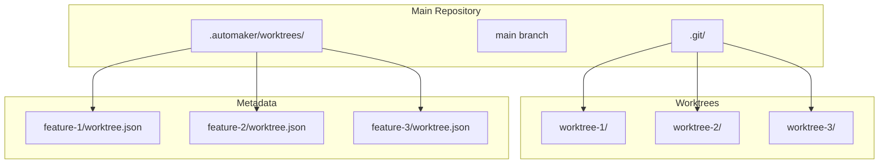
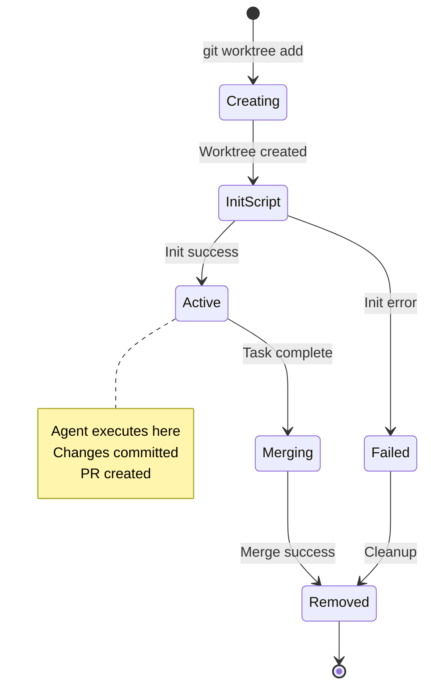
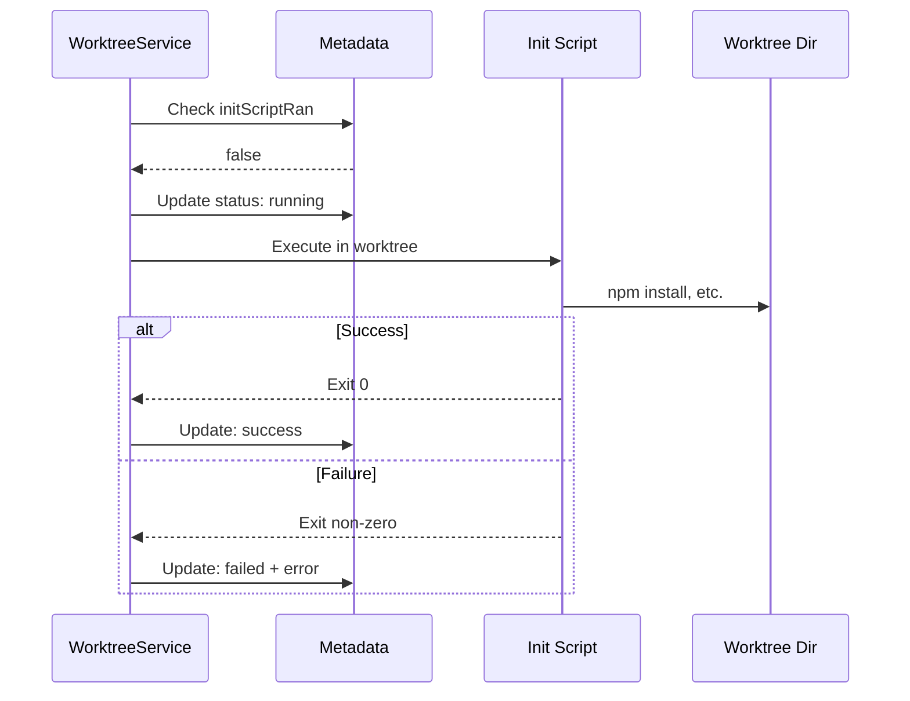

# Worktree Lifecycle Specification

## Overview

Git worktree isolation provides task-level isolation by creating dedicated worktrees for each task, preventing cross-task interference and enabling parallel development.

## Architecture



## Worktree Metadata

### Interface

```typescript
export interface WorktreePRInfo {
  number: number;
  url: string;
  title: string;
  state: string;
  createdAt: string;
}

export interface WorktreeMetadata {
  branch: string;
  createdAt: string;
  pr?: WorktreePRInfo;
  initScriptRan?: boolean;
  initScriptStatus?: 'running' | 'success' | 'failed';
  initScriptError?: string;
}
```

### Storage Location

```
/projects/my-project/
├── .automaker/
│   └── worktrees/
│       └── {sanitized-branch}/
│           └── worktree.json
└── ...
```

## Branch Name Sanitization

```typescript
const MAX_SANITIZED_BRANCH_PATH_LENGTH = 200;

function sanitizeBranchName(branch: string): string {
  let safeBranch = branch
    // Replace invalid filesystem characters
    .replace(/[/\\:*?"<>|]/g, '-')
    // Replace spaces with underscores
    .replace(/\s+/g, '_')
    // Remove trailing dots (Windows issue)
    .replace(/\.+$/g, '')
    // Collapse multiple dashes
    .replace(/-+/g, '-')
    // Remove leading/trailing dashes
    .replace(/^-|-$/g, '');

  // Truncate to safe length
  safeBranch = safeBranch.substring(0, MAX_SANITIZED_BRANCH_PATH_LENGTH);

  // Handle Windows reserved names
  const windowsReserved = /^(CON|PRN|AUX|NUL|COM[1-9]|LPT[1-9])$/i;
  if (windowsReserved.test(safeBranch) || safeBranch.length === 0) {
    safeBranch = `_${safeBranch || 'branch'}`;
  }

  return safeBranch;
}
```

### Sanitization Examples

| Input | Output |
|-------|--------|
| `feature/auth-login` | `feature-auth-login` |
| `fix: bug #123` | `fix-_bug_-123` |
| `user/john/task` | `user-john-task` |
| `CON` | `_CON` |
| `...test` | `test` |

## Lifecycle States



## Metadata Operations

### Read Metadata

```typescript
export async function readWorktreeMetadata(
  projectPath: string,
  branch: string
): Promise<WorktreeMetadata | null> {
  try {
    const metadataPath = getWorktreeMetadataPath(projectPath, branch);
    const content = await secureFs.readFile(metadataPath, 'utf-8') as string;
    return JSON.parse(content) as WorktreeMetadata;
  } catch {
    return null;
  }
}
```

### Write Metadata

```typescript
export async function writeWorktreeMetadata(
  projectPath: string,
  branch: string,
  metadata: WorktreeMetadata
): Promise<void> {
  const metadataDir = getWorktreeMetadataDir(projectPath, branch);
  const metadataPath = getWorktreeMetadataPath(projectPath, branch);

  await secureFs.mkdir(metadataDir, { recursive: true });
  await secureFs.writeFile(metadataPath, JSON.stringify(metadata, null, 2), 'utf-8');
}
```

### Update PR Info

```typescript
export async function updateWorktreePRInfo(
  projectPath: string,
  branch: string,
  prInfo: WorktreePRInfo
): Promise<void> {
  let metadata = await readWorktreeMetadata(projectPath, branch);

  if (!metadata) {
    metadata = {
      branch,
      createdAt: new Date().toISOString(),
    };
  }

  metadata.pr = prInfo;
  await writeWorktreeMetadata(projectPath, branch, metadata);
}
```

### Delete Metadata

```typescript
export async function deleteWorktreeMetadata(
  projectPath: string,
  branch: string
): Promise<void> {
  const metadataDir = getWorktreeMetadataDir(projectPath, branch);
  try {
    await secureFs.rm(metadataDir, { recursive: true, force: true });
  } catch {
    // Ignore errors
  }
}
```

## Directory Structure

### Main Repository

```
/projects/my-project/
├── .git/                          # Git directory
├── .automaker/
│   ├── features/                  # Feature definitions
│   ├── context/                   # CLAUDE.md files
│   └── worktrees/                 # Worktree metadata
│       ├── feature-auth/
│       │   └── worktree.json
│       └── feature-api/
│           └── worktree.json
├── src/                           # Source code
└── package.json
```

### Worktree Directory

```
/projects/my-project-worktrees/
├── feature-auth/
│   ├── .git                       # Worktree git link
│   ├── src/                       # Branch-specific files
│   └── package.json
└── feature-api/
    ├── .git
    └── src/
```

## Init Script Execution

### Status Tracking

```typescript
interface WorktreeMetadata {
  // ...
  initScriptRan?: boolean;
  initScriptStatus?: 'running' | 'success' | 'failed';
  initScriptError?: string;
}
```

### Execution Flow



## Read All Metadata

```typescript
export async function readAllWorktreeMetadata(
  projectPath: string
): Promise<Map<string, WorktreeMetadata>> {
  const result = new Map<string, WorktreeMetadata>();
  const worktreesDir = path.join(projectPath, '.automaker', 'worktrees');

  try {
    const dirs = await secureFs.readdir(worktreesDir, { withFileTypes: true });

    for (const dir of dirs) {
      if (dir.isDirectory()) {
        const metadataPath = path.join(worktreesDir, dir.name, 'worktree.json');
        try {
          const content = await secureFs.readFile(metadataPath, 'utf-8') as string;
          const metadata = JSON.parse(content) as WorktreeMetadata;
          result.set(metadata.branch, metadata);
        } catch {
          // Skip unreadable metadata
        }
      }
    }
  } catch {
    // Directory doesn't exist
  }

  return result;
}
```

## Security Integration

### Path Validation

All metadata operations use `secureFs`:

```typescript
// Validated against ALLOWED_ROOT_DIRECTORY
await secureFs.mkdir(metadataDir, { recursive: true });
await secureFs.writeFile(metadataPath, content);
await secureFs.readFile(metadataPath);
await secureFs.rm(metadataDir, { recursive: true });
```

### Branch Isolation

- Each worktree has its own directory
- No cross-worktree file access
- Agent executes only in assigned worktree

## Cleanup

### On Merge Success

```typescript
async function cleanupWorktree(projectPath: string, branch: string): Promise<void> {
  // 1. Remove worktree directory
  await execAsync(`git worktree remove ${getWorktreePath(branch)}`);

  // 2. Delete branch
  await execAsync(`git branch -d ${branch}`);

  // 3. Remove metadata
  await deleteWorktreeMetadata(projectPath, branch);
}
```

### On Task Failure

```typescript
async function abortWorktree(projectPath: string, branch: string): Promise<void> {
  // 1. Force remove worktree
  await execAsync(`git worktree remove --force ${getWorktreePath(branch)}`);

  // 2. Delete branch (force)
  await execAsync(`git branch -D ${branch}`);

  // 3. Remove metadata
  await deleteWorktreeMetadata(projectPath, branch);
}
```

## Related Documents

- [Isolation Layers](../architecture/isolation-layers.md) - Security model
- [Secure FS](../security/secure-fs.md) - File operations
- [Git Worktrees](../../application/integrations/git-worktrees.md) - Application spec
